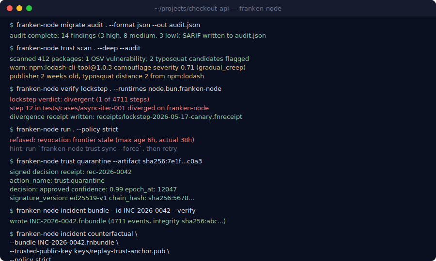
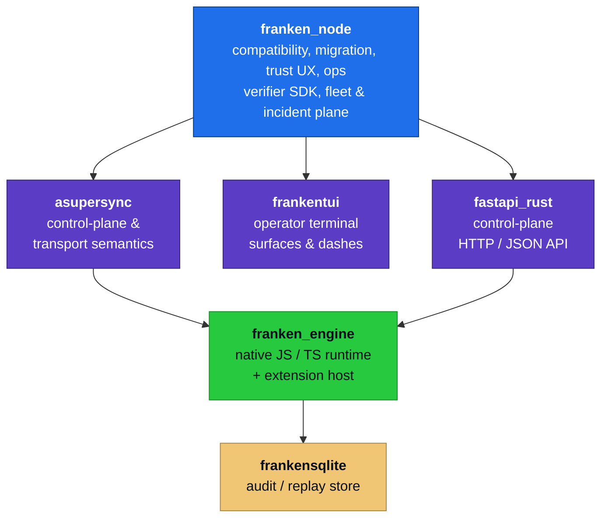
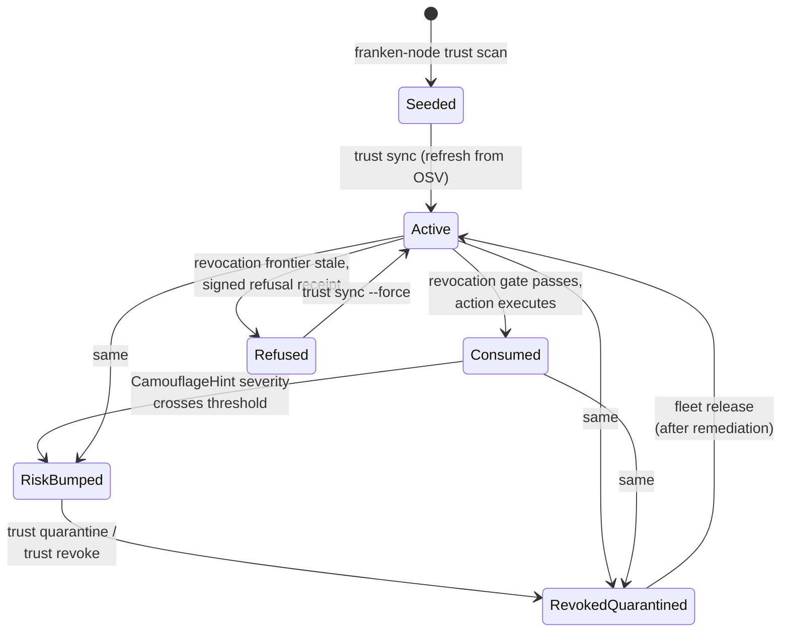
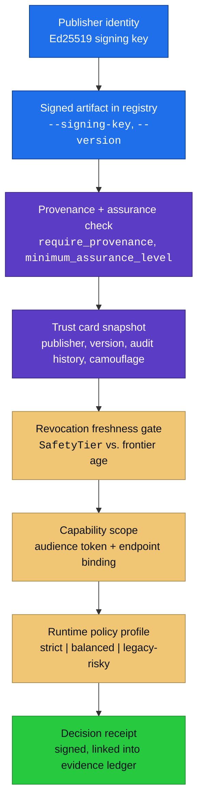

# franken_node

<div align="center">
  
</div>

<div align="center">


</div>

`franken-node` is a **trust-native JavaScript/TypeScript runtime platform** for
extension-heavy systems. It pairs Node/Bun ecosystem velocity with deterministic
security controls, cryptographically-grounded trust operations, and replayable
incident forensics.

```bash
# One-line installer (Linux / macOS)
curl -fsSL https://raw.githubusercontent.com/Dicklesworthstone/franken_node/main/install.sh | bash
```

> [!IMPORTANT]
> **Status: pre-1.0.** The CLI surface and the on-the-wire JSON shapes
> (decision receipts, trust cards, replay verdicts, counterfactual reports,
> incident bundles) are stable and covered by golden tests. Internal Rust
> APIs and feature-gated modules may still break between versions. See
> [Stability](#stability) for the full breakdown.

---

## A concrete scenario

It's Tuesday. A transitive npm dependency in your build was published 14
days ago by a brand-new publisher whose username is 2 characters off a
popular library. The package's behavior has slowly drifted in the last
three minor releases.

Under your current stack: the typosquat scanner flags it tomorrow; your
package-lock pinned the new version yesterday; the egress check runs at
deploy time and sees nothing wrong because the malicious payload
activates after a 48-hour delay. By Friday you're paging the security
team.

Under `franken-node`:

- `trust scan --deep --audit` (run on every `migrate audit`) flagged the
  publisher as 2 weeks old with typosquat distance 2 from the canonical
  package, **before the package was admitted**.
- The trust card's `camouflage_hints` have been accumulating a
  `GradualCreep` signal since the second minor release; the
  `user_facing_risk_assessment` is already at `high`.
- On any risky network egress, the **revocation freshness gate** would
  fail closed because the local frontier is older than the
  `balanced`-profile policy.
- If the malicious behavior had already executed, `incident bundle` +
  `incident replay` give you a byte-exact reproduction of the window,
  and `incident counterfactual --policy strict` tells you in seconds
  whether a tighter profile would have caught it.

Every gate above is a runtime default, not an external scanner. Every
decision is a signed receipt linked into the evidence ledger.

<div align="center">
  
</div>

---

## Who this README is for

| If you're a... | Start at |
|---|---|
| **Developer evaluating** for a new project | [TL;DR](#tldr) → [Quick Example](#quick-example) → [Comparison](#comparison) |
| **Operator deploying or running** the platform | [End-to-End Operator Workflow](#end-to-end-operator-workflow) → [Command Reference](#command-reference) → [Operational Runbooks](#operational-runbooks) → [Troubleshooting](#troubleshooting) |
| **Security auditor verifying claims** | [Trust-Native Primitives](#trust-native-primitives) → [Threat Model](#threat-model) → [Cryptographic Primitives](#cryptographic-primitives) → [Reproduction Playbook](#reproduction-playbook) → [Verifier SDK](#verifier-sdk) |
| **Architect making a build-vs-buy decision** | [Design Philosophy](#design-philosophy) → [The Trust Gradient](#the-trust-gradient) → [The Engine-Split Contract](#the-engine-split-contract) → [Limitations](#limitations) |
| **CI/SRE wiring it into pipelines** | [Integration Patterns](#integration-patterns) → [Structured Logging and Observability](#structured-logging-and-observability) → [Doctor Walkthrough](#doctor-walkthrough) |

---

## TL;DR

### The Problem

Node and Bun made rapid extension development frictionless, but the security
and operations layer never caught up. In production, teams stitch together:

- ad-hoc supply-chain scanners that scream and then get ignored
- revocation queries that run *after* a risky action ships
- incident review sessions that can never reproduce the original execution
- "permission" models that gate file access but not extension behavior
- migration spreadsheets between Node, Bun, and whatever-comes-next

Every layer is best-effort, weakly coupled, and indistinguishable from theater.

### The Solution

`franken-node` makes trust, migration, compatibility, and incident
replay part of the runtime contract, so JS/TS velocity comes with:

- **Revocation-first execution**: risky actions consult fresh trust state
  before they run, not after
- **Trust cards**: every extension carries provenance, behavior risk, audit
  history, and a camouflage assessment
- **Deterministic incident replay**: a high-severity incident exports as a
  signed bundle that any operator can replay byte-for-byte and run policy
  counterfactuals against
- **Migration autopilot**: audit → rewrite → validate → rollout, with
  rollback artifacts and lockstep validation against Bun and the franken
  runtime by default; real Node.js can be added when available
- **Fleet control plane**: quarantine, release, and reconciliation with
  signed decision receipts and convergence telemetry
- **Verifier SDK**: independent third parties can validate security and
  benchmark claims without trusting the runtime that produced them

### Why use franken-node?

| Capability | What you get |
|---|---|
| Trust cards | Per-extension provenance, risk score, audit history, camouflage assessment, revocation state |
| Revocation freshness gates | Risky and dangerous actions fail closed when trust state is stale |
| Deterministic incident replay | Signed bundles with timeline, evidence, policy decisions; replay re-derives the recorded decision sequence and verifies it against the bundle's signed hash, fail-closed on mismatch |
| Counterfactual simulator | Re-evaluate the recorded incident decision trace under a different policy mode and inspect the diff |
| Migration autopilot | Audit, rewrite, validate, and rollout transforms with rollback bundles |
| Compatibility oracle | Lockstep checks across Bun and franken-engine by default, with real Node.js as an explicit third leg when available |
| Fleet quarantine plane | Quarantine, reconcile, release across zones; signed decision receipts |
| Signed extension registry | Ed25519-signed artifacts, provenance enforcement, assurance levels |
| Remote capability tokens | Scope-bound, single-use-optional Ed25519 capability tokens with audience binding |
| Verifier SDK | Independent verification of receipts, bundles, and benchmark claims |
| Operator doctor | Workspace-pressure analyzer, close-condition receipts, evidence-readiness reports |
| Proof pipeline | VEF (Verifiable Execution Fingerprint) receipts, proof workers, queue telemetry |
| Safe-mode lifecycle | Operator-driven enter/exit with reason codes, signed state, and pre-exit checks |
| No unsafe code | `#![forbid(unsafe_code)]` in both `lib.rs` and `main.rs` |

---

## Quick Example

```bash
# 1) Install
curl -fsSL https://raw.githubusercontent.com/Dicklesworthstone/franken_node/main/install.sh | bash

# 2) Bootstrap policy and workspace metadata
franken-node init --profile balanced --scan

# 3) Audit a Node/Bun project for migration risk
franken-node migrate audit ./my-app --format json --out migration-audit.json

# 4) Apply transforms with rollback artifact
franken-node migrate rewrite ./my-app --apply --emit-rollback ./rollback-plan.json

# 5) Validate behavior in lockstep across runtimes
franken-node verify lockstep ./my-app --runtimes bun,franken-node --emit-fixtures

# 6) Seed trust cards from package.json + lockfile
franken-node trust scan ./my-app --deep --audit

# 7) Run under policy-governed runtime controls
franken-node run ./my-app --policy strict --lockstep-preflight

# 8) Diagnose environment and policy setup
franken-node doctor --verbose --json

# 9) Export and replay a high-severity incident, then run a counterfactual
franken-node incident bundle \
    --id INC-2026-0007 \
    --evidence-path ./incidents/INC-2026-0007/evidence.v1.json \
    --verify
franken-node incident replay   --bundle ./INC-2026-0007.fnbundle --trusted-public-key ./keys/replay-trust-anchor.pub
franken-node incident counterfactual \
    --bundle ./INC-2026-0007.fnbundle \
    --trusted-public-key ./keys/replay-trust-anchor.pub \
    --policy strict

# 10) Inspect fleet posture across a zone
franken-node fleet status --zone prod-us-east --verbose --json
```

---

## Charter

See the [Product Charter](docs/PRODUCT_CHARTER.md) for scope boundaries,
governance model, and decision rules. The charter is the authoritative
reference for what franken_node is, what it is not, and how direction changes
are authorized. The engine-side counterpart lives in
[`/dp/franken_engine`](https://github.com/Dicklesworthstone/franken_engine);
this repository is the **product layer** on top of that substrate.

---

## Design Philosophy

1. **Compatibility is a wedge, not the destination.**
   franken-node chases practical Node/Bun migration first, then pushes beyond
   the baseline runtimes with trust-native behavior that incumbent runtimes
   cannot retrofit.
2. **Security controls are operational, not decorative.**
   Policy gates, revocation checks, and quarantine paths are runtime defaults
   with measurable behavior, not advisory dashboards.
3. **Claims require evidence.**
   Benchmark, resilience, and security statements map to reproducible
   artifacts and a verifier SDK that runs outside the runtime that produced
   them.
4. **Determinism drives incident quality.**
   Replay and forensics depend on stable event ordering, stable schemas, and
   explicit control contracts. Schema versions are pinned and registered.
5. **Performance optimization preserves semantics.**
   Hot-path work is accepted only with conformance evidence and bounded
   tail-latency impact. Benchmarks live alongside the code they validate.

---

## Comparison

| Area | franken-node | Node.js | Bun | Deno |
|---|---|---|---|---|
| Per-extension trust cards | **Built-in** | External tooling | External tooling | External tooling |
| Revocation-aware execution gates | **Built-in** | Not native | Not native | Not native |
| Deterministic incident replay bundles | **Built-in** | Not native | Not native | Not native |
| Counterfactual policy simulation | **Built-in** | N/A | N/A | N/A |
| Compatibility divergence receipts | **Built-in** | N/A | N/A | N/A |
| Migration autopilot pipeline | **Built-in** | External scripts | External scripts | External scripts |
| Fleet quarantine control plane | **Built-in** | External platform | External platform | External platform |
| Signed extension registry | **Built-in** | npm (signature optional) | bunx (no enforcement) | deno.land (URL trust only) |
| Threshold-signature verification | **Built-in** | Not native | Not native | Not native |
| Verifier SDK for public claims | **Built-in** | N/A | N/A | N/A |
| Operator doctor + workspace pressure | **Built-in** | N/A | N/A | N/A |
| Permission model | Policy profiles + trust gates | None | None | Permission flags |
| Runtime memory safety | `forbid(unsafe_code)` Rust | C++ engine | Zig/JSC | Rust + V8 |

---

## Installation

> [!IMPORTANT]
> This repository depends on sibling engine crates from
> [`franken_engine`](https://github.com/Dicklesworthstone/franken_engine)
> via the [Engine Split Contract](docs/ENGINE_SPLIT_CONTRACT.md). Source
> builds require both repositories checked out side-by-side. The one-line
> installer side-steps this by shipping prebuilt binaries.

### Option 1: One-line installer (recommended)

**Linux / macOS:**

```bash
curl -fsSL https://raw.githubusercontent.com/Dicklesworthstone/franken_node/main/install.sh | bash
```

**Windows (PowerShell):**

```powershell
irm https://raw.githubusercontent.com/Dicklesworthstone/franken_node/main/install.ps1 | iex
```

The installer downloads the latest release asset for your platform, verifies
it against its `SHA256` sidecar (and a cosign signature when one is published),
and places `franken-node` on `PATH` (`%USERPROFILE%\.local\bin` on Windows).
Prebuilt binaries ship for **Linux x86_64**, **macOS Apple Silicon (arm64)**,
and **Windows x86_64**; on other platforms the bash installer falls back to a
side-by-side source build. Pass `--help` (bash) / `-EasyMode` (PowerShell adds
the dir to PATH) for options.

> [!NOTE]
> Homebrew is not currently published for `franken-node`; the public
> `Dicklesworthstone/homebrew-tap` repository does not yet ship a
> `franken-node` formula. Use the installer above or build from source.

### Option 2: Build from source (split-repo layout required)

```bash
# Side-by-side checkout
git clone https://github.com/Dicklesworthstone/franken_engine.git
git clone https://github.com/Dicklesworthstone/franken_node.git

cd franken_node
cargo build --release -p frankenengine-node
./target/release/franken-node --version
```

Expected local layout:

```text
<parent>/
  franken_engine/
  franken_node/
```

The Cargo workspace package is named `frankenengine-node`; the produced
binary is named `franken-node`. Rust 2024 edition; no unsafe code is
permitted by lint forbidance.

### Option 3: Verify a release archive

```bash
franken-node verify release ./release-dir --key-dir ./trusted-public-keys
```

> [!WARNING]
> `verify release` is fail-closed and accepts no built-in trust roots.
> You must point `--key-dir` at a directory of public keys you trust;
> without it, verification refuses to proceed.

---

## Quick Start

1. **Create a default config:**
   ```bash
   franken-node init --profile balanced --scan
   ```
2. **Audit an existing project:**
   ```bash
   franken-node migrate audit ./my-app --format json --out migration-audit.json
   ```
3. **Seed trust cards from your dependency graph:**
   ```bash
   franken-node trust scan ./my-app --deep --audit
   ```
4. **Validate compatibility before rollout:**
   ```bash
   franken-node verify lockstep ./my-app --runtimes bun,franken-node
   ```
5. **Run in policy-governed mode:**
   ```bash
   franken-node run ./my-app --policy strict --lockstep-preflight
   ```
6. **Inspect trust and fleet state:**
   ```bash
   franken-node trust list --risk high
   franken-node fleet status --json
   franken-node incident list --severity high
   ```
7. **Diagnose environment health:**
   ```bash
   franken-node doctor --verbose
   franken-node doctor workspace-pressure
   ```

---

## Use Cases

| Scenario | Why franken-node fits |
|---|---|
| **Regulated SaaS deploying third-party extensions** | Trust cards + revocation freshness gates + signed registry give a continuous audit trail of which artifacts ran at which version with what attestations. The verifier SDK lets external auditors validate claims without trusting the operator. |
| **Multi-region operator with quarantine SLA** | Fleet quarantine state machine emits signed decision receipts and tracks convergence per zone. `franken-node fleet reconcile` exposes whether a partitioned node has caught up. |
| **Migration from legacy Node to a hardened runtime** | `migrate audit` → `migrate rewrite --apply --emit-rollback` → `verify lockstep` is an end-to-end pipeline with rollback artifacts at every stage. The lockstep oracle catches behavioral regressions before they reach production. |
| **Post-incident counterfactual analysis** | `incident bundle --verify` exports a signed, deterministic snapshot of the incident window. `incident counterfactual --policy strict` answers "would tighter policy have blocked this?" with a reproducible diff. |
| **Public claim verification** | `frankenengine-verifier-sdk` runs outside the producing runtime. Third parties verify receipts, capsules, and counterfactuals without trusting franken-node's own logs. |
| **Operator triage under disk / build pressure** | `doctor workspace-pressure` analyzes disk, memory, RCH queue depth, and build-fleet state, routes through balanced/conservative/permissive policy, and emits recommended actions. |
| **Long-running fleet agent on edge nodes** | `fleet agent --zone <z> --poll-interval-secs <n>` runs an embedded control-plane worker that polls for and applies fleet actions with bounded retries. |
| **Compliance archival** | The evidence ledger is append-only, signature-chained, and witness-traced. Incident bundles plus the registry's signed publish records produce a defensible chain of custody. |

---

## End-to-End Operator Workflow

Concrete narrative: a platform team taking a moderately-sized Node application
through adoption, rollout, and a real incident.

### Day 0 — Adoption

```bash
# Bootstrap policy + workspace metadata + dependency trust scan
franken-node init --profile balanced --scan
```

This writes `franken_node.toml`, creates `.franken-node/state/` for durable
state, and runs a baseline `trust scan` against `package.json`. The scan
populates trust cards keyed by `npm:<scope>/<name>@<version>` with publisher
identity, publication date, dependent counts, and any OSV vulnerability
hits.

### Day 1 — Migration assessment

```bash
franken-node migrate audit ./app --format json --out audit.json
franken-node migrate-report ./app --format html --output report.html
```

`migrate audit` produces a SARIF-compatible findings file plus a
deterministic JSON inventory. `migrate-report` produces a single-document
operator-facing assessment suitable for review by stakeholders outside the
runtime team.

### Day 2 — Apply transforms, validate

```bash
franken-node migrate rewrite ./app --apply --emit-rollback rollback.json
franken-node verify lockstep ./app --runtimes bun,franken-node --emit-fixtures
```

The rollback bundle is a signed, reversible diff. The lockstep oracle runs
the project in `bun` and `franken-node` by default and records divergence
receipts (with the exact event stream that diverged); material behavioral
deltas fail closed. On hosts with a real Node.js binary, add it explicitly with
`--runtimes node,bun,franken-node`.

### Day 5 — Pre-production validation

```bash
franken-node verify recovery-runbook --readiness-input broker-snapshot.json
franken-node doctor --verbose --json
franken-node ops validation-readiness --input broker-snapshot.json
```

The validation broker integrates RCH worker health, evidence freshness,
proof-cache state, and target-dir hygiene. If any precondition is stale,
the recovery runbook tells the operator exactly which gates need to be
re-run.

### Day 7 — Production rollout

```bash
franken-node run ./app --policy balanced --lockstep-preflight
```

The `--lockstep-preflight` flag runs one final lockstep comparison before
the runtime boots the application. Divergence aborts the run with a
signed receipt.

### Day 21 — Incident

A high-severity alert fires; a transitive npm dependency was revoked
upstream due to a typosquatting attack. The revocation freshness gate
catches it on the next risky action and quarantines the node.

```bash
# Containment
franken-node fleet status --json --verbose
franken-node trust quarantine --artifact sha256:abc...

# Forensics
franken-node incident list --severity high
franken-node incident bundle --id INC-2026-0042 --verify
franken-node incident replay --bundle INC-2026-0042.fnbundle \
    --trusted-public-key keys/replay-trust-anchor.pub

# Counterfactual: would strict mode have blocked this?
franken-node incident counterfactual --bundle INC-2026-0042.fnbundle \
    --trusted-public-key keys/replay-trust-anchor.pub --policy strict
```

The incident bundle is a self-contained, deterministic snapshot: timeline,
environment, policy decisions, evidence-ledger entries, and the trust
artifacts referenced during the incident. The counterfactual report
includes a diff of decisions, actions taken vs. blocked, and any newly
emitted evidence.

### Day 22 — Release

```bash
franken-node fleet release --incident INC-2026-0042 --json
```

`fleet release` lifts quarantine with a signed receipt and waits for
convergence across all nodes in scope. `franken-node fleet reconcile`
confirms convergence; `franken-node fleet status --verbose` shows
per-node application of the release.

### Quarterly — Public claim verification

```bash
# Independent third party, with their own trust anchors
franken-node verify release ./release-dir --key-dir ./auditor-trust-roots
franken-node bench run --scenario secure-extension-heavy --output bench.json
```

Auditors use `frankenengine-verifier-sdk` to validate the benchmark
report's signature chain, recompute receipts, and verify capsule integrity
without trusting the runtime that produced them.

---

## Stability

`franken-node` is pre-1.0. The contract surface is split into three
stability bands:

| Surface | Stability | Notes |
|---|---|---|
| CLI command shape (`franken-node …` subcommands, flags, exit codes) | **Stable** | Removals and breaking flag changes land as a deliberate deprecation with a CHANGELOG entry. Downstream tests assert this surface in `cli_subcommand_goldens.rs`. |
| On-the-wire JSON shapes (decision receipts, trust cards, replay verdicts, counterfactual reports, incident bundles, structured-log events) | **Stable** | Every shape has a `schema_version` and goldens under `tests/golden/`. Schema bumps are explicit and registered in `schema_versions.rs`. |
| Internal Rust APIs (everything under `crates/franken-node/src/`) | **In flux** | Module names, struct fields, and feature-gated surfaces may change between versions. Pin a specific commit when depending. |
| External verifier SDK (`frankenengine-verifier-sdk` at `sdk/verifier/`) | **Stabilizing** | Smaller, intentionally narrower than the product crate; intended to be the long-lived audit interface. |

Anything not yet documented here, expect movement. The headline claims
("trust-native runtime", "deterministic replay", "fail-closed gates")
are backed by code today; the goal of pre-1.0 is to finalize ergonomics
and dependency hygiene, not to retract the security commitments.

---

## Runtime Profiles

`--profile <name>` (or `FRANKEN_NODE_PROFILE`) selects the **runtime policy
profile**, not the packaging profile:

| Profile | When to use | Behavior |
|---|---|---|
| `strict` | High-assurance environments, regulated workloads, post-incident lockdowns | Maximum trust-card freshness requirements, revocation gates on all risky actions, all divergence emits receipts, lockstep validation required before rollout |
| `balanced` | Default for most teams | Reasonable freshness windows, revocation gates on risky and dangerous classes, lockstep validation recommended |
| `legacy-risky` | Constrained migration windows on legacy codebases | Permits insecure compatibility behaviors when explicitly enabled by policy. Not a long-term mode. |

Packaging profiles (`local`, `dev`, `enterprise`) live in
[`packaging/profiles.toml`](packaging/profiles.toml) and govern installer
metadata, not runtime behavior.

---

## Runtime Lane Scheduler

The runtime separates concurrent work into **scheduler lanes** so that
hot-path work cannot starve control-critical work and so that bulk
maintenance cannot push real-time deadlines past their SLO. There are
two related layers:

**The four logical lanes** (`runtime::lane_scheduler::SchedulerLane`):

| Lane | Carries | Stable label |
|---|---|---|
| `ControlCritical` | Epoch transitions, barrier coordination, marker writes | `control_critical` |
| `RemoteEffect` | Remote computation invocations, artifact uploads | `remote_effect` |
| `Maintenance` | Garbage collection, compaction, cleanup tasks | `maintenance` |
| `Background` | Telemetry export, log rotation, low-priority housekeeping | `background` |

Each lane has a built-in priority order (top to bottom above) so that
`ControlCritical` work always wins arbitration against `Background` work
when both are runnable.

**Named lane configs** (`[runtime.lanes.<name>]` in `franken_node.toml`)
parameterize the concrete bulkhead each task class is routed through.
Common configurations:

```toml
[runtime.lanes.cancel]
max_concurrent = 12
priority_weight = 100
queue_limit = 24
enqueue_timeout_ms = 25
overflow_policy = "reject"

[runtime.lanes.realtime]
max_concurrent = 24
priority_weight = 60
queue_limit = 48
enqueue_timeout_ms = 75
overflow_policy = "enqueue-with-timeout"
```

Task classes are stable identifiers (`runtime::lane_scheduler::TaskClass`)
that the runtime maps to lanes via mapping rules. Built-in classes
include `epoch_transition`, `barrier_coordination`, `marker_write`,
`remote_computation`, `artifact_upload`, `artifact_eviction`,
`garbage_collection`, `compaction`, `telemetry_export`, and
`log_rotation`. Operators can inspect or exercise lane behavior with:

```bash
franken-node runtime lane status --json
franken-node runtime lane assign epoch_transition --trace-id ops-poke
```

The lane assignment path is deterministic: the same task class with the
same timestamp routes to the same lane. The lockstep oracle and replay
engine depend on that property to work across runs.

---

## Network Egress and SSRF Policy

`security::ssrf_policy` and `security::network_guard` together enforce
**egress policy** as a runtime default. Every outbound network call from
the runtime, an extension, or a remote-capability operation transits the
SSRF policy gate before any TCP socket opens.

The policy is configured in `franken_node.toml`:

```toml
[security.network_policy]
mode = "enforced"     # enforced | report-only
```

Mechanics:

- **CIDR awareness.** `CidrRange` represents IPv4 CIDR blocks; the gate
  rejects connections to any IP that falls inside a deny CIDR before the
  socket opens. `is_private_ip` blocks the standard private ranges
  (`10/8`, `172.16/12`, `192.168/16`) and loopback by default unless an
  explicit allowlist entry permits them.
- **Allowlist entries.** `AllowlistEntry` items pin a hostname (or CIDR),
  optional port, and the connector ID that may use it. The allowlist is
  scoped per connector so a misbehaving extension cannot piggyback on
  another extension's permissions.
- **DNS rebinding defense.** `check_ssrf_resolved_ips` re-validates
  every resolved IP from a hostname after DNS resolution; a hostname
  that allow-listed against `1.2.3.4` but suddenly resolves to
  `127.0.0.1` is rejected.
- **Policy receipts.** Each enforcement decision can emit a
  `PolicyReceipt` and a `SsrfAuditRecord` that lands in the evidence
  ledger so post-mortems can reconstruct exactly which endpoint was
  reached, denied, or rebound.
- **Capability binding.** `franken-node remotecap issue --endpoint <e>`
  pins capability tokens to specific endpoints; the gate refuses use of
  a token at any other endpoint regardless of the operation requested.
- **Report-only mode.** During migration, `mode = "report-only"` allows
  the call but records the would-be-decision so operators can review
  before flipping the gate to `enforced`.

Network allowlist parsing is fuzz-covered
(`fuzz_targets/network_allowlist_entry_*`) and the rebind path is
exercised by the connector interop suites.

---

## Command Reference

`franken-node --help` prints the full surface. The following tables list
every leaf command available in the current build.

### Core lifecycle

| Command | Purpose |
|---|---|
| `franken-node init` | Bootstrap config, policy profile, and `.franken-node/state/` workspace metadata. Flags: `--profile`, `--config`, `--out-dir`, `--overwrite`, `--backup-existing`, `--scan`, `--state-dir`, `--no-state`, `--json`. |
| `franken-node run <app_path>` | Run app under policy-governed runtime controls. Flags: `--policy`, `--config`, `--runtime` (auto\|node\|bun\|franken-engine), `--engine-bin`, `--lockstep-preflight`, `--json`. |
| `franken-node doctor` | Diagnose environment and policy setup. Flags: `--config`, `--profile`, `--policy-activation-input`, `--verbose`, `--json`, `--structured-logs-jsonl`. |

### Migration

| Command | Purpose |
|---|---|
| `franken-node migrate audit <path>` | Inventory migration risk. Flags: `--format` (json\|text\|sarif), `--out`. |
| `franken-node migrate rewrite <path>` | Apply migration transforms. Flags: `--apply`, `--emit-rollback`. |
| `franken-node migrate validate <path>` | Validate transformed project with conformance checks. |
| `franken-node migrate-report <path>` | Export one-command migration assessment (json\|html). |

### Verification

| Command | Purpose |
|---|---|
| `franken-node verify module <id>` | Verify module conformance. |
| `franken-node verify migration <id>` | Verify migration compatibility. |
| `franken-node verify compatibility <target>` | Verify compatibility claims. |
| `franken-node verify corpus <path>` | Verify corpus schema and coverage. |
| `franken-node verify lockstep <path>` | Compare behavior across runtimes; default `--runtimes bun,franken-node`; use `--runtimes node,bun,franken-node` only when `node` is a real Node.js binary. `--emit-fixtures` writes divergence fixtures. |
| `franken-node verify release <path>` | Verify release artifact signatures. **Fails closed without `--key-dir`.** |
| `franken-node verify transparency-log <path>` | Verify transparency-log integrity. |
| `franken-node verify recovery-runbook` | Generate recovery runbook from `--readiness-input`. |

### Trust and supply chain

| Command | Purpose |
|---|---|
| `franken-node trust card <id>` | Show trust profile for one extension. |
| `franken-node trust list` | List extensions; filter by `--risk`, `--revoked`. |
| `franken-node trust scan [path]` | Populate baseline trust cards from package.json. Flags: `--deep`, `--audit`. |
| `franken-node trust sync` | Refresh trust-card cache and npm vulnerability state from OSV; `--force` to ignore caches. |
| `franken-node trust revoke <id>` | Revoke artifact or publisher trust. Optional `--receipt-signing-key`, `--receipt-out`. |
| `franken-node trust quarantine` | Quarantine a suspicious artifact fleet-wide. `--artifact` required. |
| `franken-node trust-card show <id>` | Show full trust card. |
| `franken-node trust-card export <id> --json` | Export trust card as canonical JSON. |
| `franken-node trust-card list` | List with filters: `--publisher`, `--query`, `--page`, `--per-page`. |
| `franken-node trust-card compare <left> <right>` | Compare two trust postures. |
| `franken-node trust-card diff <id> <left_version> <right_version>` | Diff one card across versions. |

### Remote capabilities

| Command | Purpose |
|---|---|
| `franken-node remotecap issue` | Issue signed Ed25519 capability token. Required: `--scope`, `--endpoint`. Optional: `--ttl`, `--issuer`, `--operator-approved`, `--single-use`. |
| `franken-node remotecap verify` | Verify a capability token without using it. Required: `--token-file`, `--operation`, `--endpoint`. |
| `franken-node remotecap use` | Use capability token for an operation. Same required flags as `verify`. |
| `franken-node remotecap revoke` | Revoke a capability token. Required: `--token-file`. |

### Fleet control plane

| Command | Purpose |
|---|---|
| `franken-node fleet status` | Show policy and quarantine state across nodes. Flags: `--zone`, `--verbose`, `--json`. |
| `franken-node fleet describe <node>` | Describe one fleet node with zone context and incident state. |
| `franken-node fleet release` | Lift quarantine/revocation controls with signed receipts. `--incident` required. |
| `franken-node fleet reconcile` | Reconcile fleet state with control plane. |
| `franken-node fleet agent` | Run as an embedded fleet agent. Flags: `--node-id`, `--zone` (required), `--poll-interval-secs`, `--max-cycles`, `--once`. |

### Incident replay and forensics

| Command | Purpose |
|---|---|
| `franken-node incident bundle` | Export deterministic incident bundle. `--id` required; reads evidence from `--evidence-path` or `<project-root>/.franken-node/state/incidents/<slug>/evidence.v1.json`. `--verify` checks the bundle after writing. Optional receipt-signing controls. |
| `franken-node incident replay` | Replay incident timeline locally. **Fails closed without `--trusted-public-key` or `--key-dir`.** |
| `franken-node incident counterfactual` | Simulate alternative policy actions. Same trust-anchor requirement as `replay`. Required: `--policy`. Optional: `--promote`, `--promotion-signing-key`, `--operator-id`. |
| `franken-node incident list` | List recorded incidents. Filter: `--severity`. |

### Runtime, safe-mode, and proofs

| Command | Purpose |
|---|---|
| `franken-node runtime lane status` | Emit default lane policy and telemetry snapshot. |
| `franken-node runtime lane assign <task_class>` | Assign one task class through the default lane scheduler. |
| `franken-node runtime epoch` | Inspect control epoch compatibility. Flags: `--local-epoch`, `--peer-epoch`. |
| `franken-node safe-mode enter` | Enter safe mode and persist operator state. Required: `--reason`, `--operator-id`, `--trust-state-hash`. Reasons: `explicit-flag`, `environment-variable`, `config-field`, `trust-corruption`, `crash-loop`, `epoch-mismatch`. |
| `franken-node safe-mode status` | Inspect persisted safe-mode state. |
| `franken-node safe-mode exit` | Exit safe mode after explicit operator confirmation. Required: `--operator-id`, `--confirm`. Pre-exit checks: `--trust-state-consistent`, `--no-unresolved-incidents`, `--evidence-ledger-intact`. |
| `franken-node proofs queue status` | Inspect proof queue, proof status, and worker readiness from broker snapshots. |
| `franken-node proofs workers restart` | Validate and emit proof worker restart requests. Required: `--operator-id`, `--operator-role`, `--reason`, `--confirm`. |

### Ops and diagnostics

| Command | Purpose |
|---|---|
| `franken-node ops health-check` | Process and runtime health signals. |
| `franken-node ops resource-governor` | Advise whether validation should run / defer / deduplicate based on a process snapshot, proof class, RCH queue depth, and target-dir usage. |
| `franken-node ops validation-readiness` | Report validation broker evidence freshness from receipts. |
| `franken-node ops validation-closeout` | Render closeout summary from a receipt. Required: `--bead-id`, `--receipt`. |
| `franken-node ops config-audit` | Audit active config across profiles. |
| `franken-node ops metrics` | Emit operator metrics (Prometheus by default). |
| `franken-node doctor workspace-pressure` | Analyze workspace pressure: disk, memory, builds, RCH; routes through balanced/conservative/permissive policy. |
| `franken-node doctor close-condition` | Emit dual-oracle close-condition receipt. |
| `franken-node doctor evidence-readiness` | Report evidence readiness from a broker snapshot. |

### Registry, bench, debug

| Command | Purpose |
|---|---|
| `franken-node registry publish <package>` | Publish signed extension artifact. **Required: `--version` and `--signing-key`** (raw Ed25519 32-byte key; hex, base64, or supported JSON wrapper). Optional: `--max-active-artifacts`. |
| `franken-node registry search <query>` | Query extension registry. Filter: `--min-assurance`. |
| `franken-node registry verify <id>` | Verify a locally stored registry artifact. |
| `franken-node registry gc` | Archive older registry artifacts. Optional: `--keep`. |
| `franken-node bench run` | Run benchmark suite and emit signed report. Flags: `--scenario`, `--fixture-mode`, `--output`. |
| `franken-node debug explain` | Walk a signed decision-receipt through verification steps. Required: `--receipt`. |
| `franken-node debug evidence` | Inspect verifier evidence artifacts. Required: `--artifact`. `--kind` accepts `auto`, `node-replay-capsule`, `provenance-attestation`, `vef-evidence-capsule`. |
| `franken-node debug trace` | Trace policy evaluation steps. Required: `--policy`, `--input`. |

> [!NOTE]
> All commands accept `--json` for machine-readable output. Many also
> accept `--structured-logs-jsonl` to emit stable, event-coded
> diagnostic events on stderr (see [Structured Logging and
> Observability](#structured-logging-and-observability)), and
> `--trace-id <id>` to correlate log events across processes.

> [!WARNING]
> **Fail-closed commands.** `incident replay` and `incident
> counterfactual` refuse to run without `--trusted-public-key` or
> `--key-dir`. `registry publish` refuses without `--version` and
> `--signing-key`. `verify release` refuses without `--key-dir`.
> `safe-mode enter` requires `--reason`, `--operator-id`, and
> `--trust-state-hash`. There are no built-in trust roots and no
> implicit defaults; this is intentional, not an ergonomics gap.

---

## Configuration

`franken_node.toml` (discovered from the working directory, the
project root, or the path passed to `--config`):

```toml
# Runtime profile: strict | balanced | legacy-risky
profile = "balanced"

[compatibility]
# API compatibility mode for migration and runtime dispatch
mode = "balanced"
# Divergence receipts are always recorded in production profiles
emit_divergence_receipts = true
# TTL for signed compatibility receipts
default_receipt_ttl_secs = 3600

[migration]
# Enable automatic rewrite suggestions
autofix = true
# Require lockstep validation before rollout stage transition
require_lockstep_validation = true

[trust]
# Revocation freshness requirements by action class
risky_requires_fresh_revocation = true
dangerous_requires_fresh_revocation = true
# Quarantine defaults
quarantine_on_high_risk = true

[replay]
# Persist high-severity replay artifacts
persist_high_severity = true
# Deterministic bundle export format version
bundle_version = "v1"
# Maximum permitted replay capsule freshness window
max_replay_capsule_freshness_secs = 3600

[registry]
# Enforce signature and provenance gates
require_signatures = true
require_provenance = true
minimum_assurance_level = 3

[fleet]
# Optional override for the persisted fleet transport state root
state_dir = ".franken-node/state/fleet"
# Fleet convergence timeout for quarantine/release operations
convergence_timeout_seconds = 120

[observability]
# Stable metrics namespace for automation
namespace = "franken_node"
emit_structured_audit_events = true

[remote]
# Default TTL for remote idempotency entries
idempotency_ttl_secs = 604800

[security]
# Maximum degraded-mode duration before suspension
max_degraded_duration_secs = 3600

[security.network_policy]
# Network egress policy enforcement mode: enforced | report-only
mode = "enforced"

[engine]
# Optional path override for the franken_engine binary
# binary_path = "/usr/local/bin/franken-engine"

[runtime]
# Preferred runtime: auto | node | bun | franken-engine
preferred = "auto"
# Global cap on in-flight network-bound operations
remote_max_in_flight = 50
# Retry hint when bulkhead is saturated
bulkhead_retry_after_ms = 50

[runtime.lanes.cancel]
max_concurrent = 12
priority_weight = 100
queue_limit = 24
enqueue_timeout_ms = 25
overflow_policy = "reject"

[runtime.lanes.realtime]
max_concurrent = 24
priority_weight = 60
queue_limit = 48
enqueue_timeout_ms = 75
overflow_policy = "enqueue-with-timeout"

[thresholds]
# Algorithmic/statistical thresholds (all optional, with safe defaults)
max_failure_rate = 0.05
min_quality_score = 0.8
max_variance_pct = 5.0
regression_threshold_pct = 10.0
```

`franken-node init` writes a starter file with the active profile and the
default state layout. `franken-node ops config-audit --json` prints the
resolved configuration with profile overlays applied.

---

## Crate Features

The `frankenengine-node` crate ships a granular feature surface. Defaults
keep the binary small; product surfaces opt in explicitly.

| Feature | Default | Purpose |
|---|---|---|
| `engine` | ✅ | Links the sibling `frankenengine-engine` and `frankenengine-extension-host` crates. |
| `http-client` | ✅ | Outbound HTTP client support (`ureq`, `url`). |
| `external-commands` | ✅ | External command/process helpers (`which`, `ctrlc`). |
| `extended-surfaces` | opt-in | Legacy umbrella over the granular product features below. |
| `control-plane` | opt-in | API middleware, fleet operations, control-plane functionality. |
| `policy-engine` | opt-in | Security policies, guardrail monitors, hardening state machines. |
| `remote-ops` | opt-in | Remote operations, distributed coordination, eviction sagas. |
| `admin-tools` | opt-in | Enterprise governance, migration tools, administrative functionality. |
| `verifier-tools` | opt-in | Verifier-specific tooling, economy, and SDK surfaces. |
| `advanced-features` | opt-in | Claims, conformance, encoding, extensions, federation, performance, and repair surfaces. |
| `test-support` | opt-in | Shared test helpers (enables `control-plane` and `admin-tools`). |
| `asupersync-transport` | opt-in | Direct asupersync transport integration. |
| `compression` | opt-in | Gzip/deflate support via `flate2`. |
| `cbor-serialization` | opt-in | CBOR encoding support via `serde_cbor`. |
| `blake3` | opt-in | Optional BLAKE3 hashing support. |

```bash
# Enable everything except packaging extras
cargo build --release -p frankenengine-node --features extended-surfaces

# Build a minimal node binary with no product surfaces
cargo build --release -p frankenengine-node --no-default-features --features engine
```

---

## Architecture



### Repository layout

| Path | Purpose |
|---|---|
| `Cargo.toml` | Workspace manifest (`crates/franken-node`, `crates/franken-security-macros`, `sdk/verifier`) |
| `crates/franken-node/src/main.rs` | Binary entrypoint and CLI dispatch |
| `crates/franken-node/src/lib.rs` | Library exports, bounded I/O helpers, lock utilities |
| `crates/franken-node/src/cli.rs` | Stable CLI argument shapes (the contract downstream tests assert) |
| `crates/franken-node/src/config.rs` | Config discovery, profile resolution, CLI override merging |
| `crates/franken-security-macros/` | Internal proc-macro helpers |
| `sdk/verifier/src/lib.rs` | Public verifier-facing SDK (`frankenengine-verifier-sdk`) |
| `docs/specs/**` | Product contracts (gates, schemas, runbooks) |
| `tests/**`, `crates/franken-node/tests/**` | Integration, conformance, contract, e2e, golden, security, perf tests |
| `scripts/check_*.py` | 430+ Python validators wired into CI gates |
| `.github/workflows/` | Gate-oriented CI: claim gates, conformance gates, closer-discipline, mutants, coverage, security-golden-artifacts, etc. |
| `packaging/profiles.toml` | Packaging profile metadata (`local`, `dev`, `enterprise`) |

### Core source domains

| Domain | What lives there |
|---|---|
| `cli`, `config`, `main` | CLI surface, profile resolution, structured logging |
| `runtime/` | Epoch transitions, lane scheduler/router, safe-mode controller, bulkhead, resource governor, lockstep harness, hardware planner, speculation |
| `control_plane/` | Control epoch barriers, fork detection, audience tokens, MMR proofs, marker stream, divergence gate, evidence replay gate, key-role separation |
| `security/` | Constant-time comparisons, revocation freshness, threshold signatures, remote capabilities, sandbox policy compiler, SSRF policy, sybil defense, zk attestation, challenge flow, DGIS, BPET |
| `supply_chain/` | Trust cards, certification, camouflage assessment, attestation manifest |
| `migration/` | Migration audit, rewrite, validate, BPET migration gate, deterministic audit logs |
| `replay/` | Time-travel engine, replay verdicts, divergence detection |
| `tools/` | Replay bundle builder with fsync-backed durability |
| `vef/` | Verifiable Execution Fingerprint: proof service, generator, scheduler, verifier, receipt chain |
| `dgis/` | Dependency Graph Immune System: contagion simulator, fragility model, SPOF detection |
| `atc/` | Autonomous Trust Control surface contract and fingerprinting |
| `federation/` | Privacy-preserving cross-deployment threat learning, ATC↔BPET↔DGIS bridges |
| `observability/` | Evidence ledger, durability violation detection, witness ref tracking |
| `ops/` | Validation broker / planner / proof cache / debt ledger, doctor, evidence index, cleanup executor |
| `extensions/`, `registry/` | Signed extension publication, schema enforcement, GC, search |
| `connector/` | Adapter layer (CRDT, lease coordinator, durability, ecosystem compliance, rollout state, verifier SDK glue) |
| `remote/`, `api/` | Remote capability lifecycle, fleet quarantine API surface, session auth |
| `storage/` | `frankensqlite` adapter, retrievability gate, cleanup receipts |
| `verifier_economy/`, `claims/`, `encoding/`, `repair/` | Reputation/staking, claim compiler, canonical serialization, recovery orchestration |
| `sdk/verifier/` | External verifier SDK (bundle, capsule, counterfactual, top-level `lib.rs`) |

---

## Trust-State Lifecycle

A trust card moves through a small set of operationally meaningful
phases. These labels are descriptive, not enum variants in the source.
What the source models concretely is the card's
`user_facing_risk_assessment`, `revocation_status`, `audit_history`,
`camouflage_hints`, and `reputation_trend`; the diagram below shows
how those fields evolve over the lifecycle of a single card. The
registry separately validates the card snapshot under a
`SnapshotSourceContext` (`TrustedFile` for local loads, `UntrustedNetwork`
for remote refreshes), which picks the validation strategy without
being stored on the card itself.



Every transition is recorded in the card's `audit_history` and (for
fleet-visible transitions) in the evidence ledger. A card's full history
is replayable: an auditor can reconstruct exactly which decisions ran
under which snapshot.

---

## Trust-Native Primitives

Every primitive below is implemented in `crates/franken-node/src/`;
none are CLI-only stubs. Each has accompanying integration and
conformance tests under `tests/` and `crates/franken-node/tests/`.

| Primitive | Module | Properties |
|---|---|---|
| **Trust cards** | `supply_chain::trust_card` | Publisher identity, risk assessment, audit history, version tracking, camouflage hint, HMAC-signed snapshots, trusted-vs-untrusted source context |
| **Revocation freshness gates** | `security::revocation_freshness{_gate}` | SafetyTier-based (Standard/Risky/Dangerous) age policies; `now >= expires_at` fail-closed semantics; bound to capability issuance |
| **Fleet quarantine state machine** | `api::fleet_quarantine`, `control_plane::fleet_transport` | `QuarantineScope`, `FleetAction` (quarantine/revoke/release), signed `DecisionReceipt`, `ConvergencePhase` tracking, file-backed durable transport |
| **Deterministic incident replay** | `replay::time_travel_engine`, `tools::replay_bundle` | `WorkflowTrace` capture, environment snapshot, schema versioning, `ReplayVerdict`, divergence detection, fsync-backed durable serialization |
| **Counterfactual simulator** | `replay::time_travel_engine` + `sdk/verifier` | Re-execute the same trace under an alternative `--policy`; emit diff of decisions, blocked actions, and evidence |
| **Compatibility lockstep oracle** | `runtime::lockstep_harness`, `api::compat_gate` | N-version execution across Bun/franken-engine by default, with optional real Node.js coverage and divergence receipts |
| **Migration autopilot** | `migration::*`, BPET migration gate | Audit → rewrite → validate → rollout; deterministic audit logs; rollback bundles |
| **Signed extension registry** | `registry::*`, `extensions::artifact_contract` | Ed25519-signed artifacts, schema enforcement, assurance levels, GC, search |
| **Threshold signature verification** | `security::threshold_sig` | k-of-n quorum, cached configurations, domain-separated and constant-time verification |
| **MMR proofs** | `control_plane::mmr_proofs` | Merkle-Mountain-Range inclusion/prefix proofs, raw-hash internals, rebuild/sync from marker streams |
| **Audience tokens** | `control_plane::audience_token` | Expiry, attenuation, domain separation, token chains with depth/root/leaf accessors, replay-resistant nonce window |
| **Fork detection** | `control_plane::fork_detection` | State-vector hashing, rollback proofs, marker-proof verifier, `DetectionResult` (`Converged`/`Forked`/`GapDetected`/`RollbackDetected`) |
| **Control epoch barriers** | `control_plane::control_epoch`, `epoch_transition_barrier` | Validity-window policy, `EpochRejectionReason` enum, fail-closed artifact rejection |
| **Evidence ledger** | `observability::evidence_ledger` | Append-only Ed25519-signed decision log, hash-chain prev-entry linkage, replay-attack detection, bounded capacity with eviction, optional spill-to-disk |
| **Remote capability tokens** | `security::remote_cap`, `remote::*` | Scope-bound, single-use-optional Ed25519 tokens with endpoint binding |
| **DGIS adversarial topology** | `security::dgis`, `dgis::*` | Dependency contagion simulator, fragility model, SPOF detection, immunization planner |
| **BPET evolution risk scorer** | `security::bpet`, `migration::bpet_migration_gate` | Phenotype feature extraction, topology risk delta during rollout |
| **ATC adversarial trajectory checker** | `security::trajectory_gaming` + `federation::atc_*` | Camouflage detection severity, ATC participation weighting, reciprocity tracking |
| **VEF execution receipts** | `vef::*` | Proof service / generator / scheduler / verifier, linked receipt chain, fail-closed verification |
| **Verifier SDK** | `sdk/verifier` (`frankenengine-verifier-sdk`) | Independent bundle replay, capsule verification, counterfactual reasoning outside the producing runtime |

---

## The Trust Gradient

Trust in franken-node is graduated rather than binary. The same
extension flows through the same set of gates on every action, and the
gates layer:



Each layer can fail closed independently. The gate-by-gate decomposition
is what enables the counterfactual simulator to answer "would tightening
*one* gate have prevented this?" rather than just "was this incident
preventable?".

The same model in words:

1. **Identity.** Every publish path requires an Ed25519 signing key and
   an explicit `--version`. There is no anonymous publish path.
2. **Storage integrity.** The registry recomputes the artifact hash on
   read and verifies the signature in constant time.
3. **Provenance.** `registry.require_provenance = true` rejects
   artifacts that did not arrive with attestation metadata.
4. **Reputation.** Trust cards aggregate publisher behavior over time;
   camouflage assessment penalizes trajectories that drift toward
   adversarial patterns.
5. **Currency.** Revocation freshness gates refuse risky and dangerous
   actions when the local frontier is older than policy allows.
6. **Audience.** Capability tokens are bound to specific endpoints and
   operations; a token issued for one endpoint cannot be used at
   another.
7. **Profile.** The operator-selected runtime profile sets thresholds
   for every gate above, all at once.
8. **Audit.** Every gate decision is recordable as a signed receipt
   linked into the evidence ledger.

---

## Remote Capability Operations

A capability token is bound to a specific **remote operation** plus an
endpoint. The operation vocabulary is enumerated in
`security::remote_cap::RemoteOperation`:

| Operation | Canonical name | Used for |
|---|---|---|
| `NetworkEgress` | `network_egress` | Generic outbound network calls |
| `FederationSync` | `federation_sync` | Pulling federated state from a peer deployment |
| `RevocationFetch` | `revocation_fetch` | Pulling fresh revocation frontiers |
| `RemoteAttestationVerify` | `remote_attestation_verify` | Verifying an attestation served by a remote service |
| `TelemetryExport` | `telemetry_export` | Shipping telemetry to an external sink |
| `RemoteComputation` | `remote_computation` | Off-host compute (e.g., remote proof generation) |
| `ArtifactUpload` | `artifact_upload` | Publishing artifacts to a remote registry |

The capability gate also tracks a `ConnectivityMode`:

- `Connected`: outbound network is permitted under policy.
- `LocalOnly`: every remote operation fails closed regardless of the
  capability token; useful in safe mode or for offline replays.

`RemoteScope` aggregates the set of allowed operations on a token.
Single-use tokens (`remotecap issue --single-use`) burn their scope
after one accepted use; reuse fails closed. Token use also re-validates
the resolved IP set so a token issued for one endpoint cannot be
silently redirected by DNS changes (see Network Egress and SSRF Policy).

---

## Capability Artifact Format

Extensions that want to declare exactly what capabilities they expect
ship a **capability artifact** alongside their package. The format is
governed by `extensions::artifact_contract` with
`SCHEMA_VERSION = "capability-artifact-v1.0"`. The shape:

| Type | Purpose |
|---|---|
| `CapabilityEntry` | One requested capability with bounded inputs (`ARTIFACT_TOKEN_INPUT_POLICY`) |
| `CapabilityContract` | The full list of `CapabilityEntry` items the extension declares; subject to `ARTIFACT_CAPABILITY_LIST_POLICY` length bounds |
| `ExtensionArtifact` | The wire-format artifact: contract + signature + provenance metadata |
| `AdmissionDenialReason` | Typed refusal reason emitted when the registry refuses admission |

The module exports stable `event_codes`, `error_codes`, and `invariants`
sub-modules so a SIEM filter or auditor can pin on the codes without
parsing message text. Admission is fail-closed: every refusal produces
a typed `AdmissionDenialReason` and (where appropriate) a signed
decision receipt.

`franken-node registry publish` accepts the artifact alongside the
package; `franken-node registry verify <id>` recomputes the contract
hash and validates the signature in constant time.

---

## How the Primitives Work

### Trust cards

A trust card is a per-extension record carrying publisher identity, audit
history, version chain, vulnerability state, camouflage assessment, and
revocation status. Cards are HMAC-signed snapshots; the registry loads
them under a `SnapshotSourceContext` of either `TrustedFile`
(operator-managed local loads, lazy validation) or `UntrustedNetwork`
(remote refreshes during `trust sync`, eager pre-parse signature check
and a hard JSON size cap). The card itself carries `card_hash` and
`registry_signature` so its integrity is verifiable regardless of which
context loaded it.

Camouflage assessment is produced by `security::bpet::camouflage_detector`
and surfaced through `security::trajectory_gaming::CamouflageHint`, whose
`kind` is one of `PhaseShift`, `Dropout`, `DistributionMismatch`, or
`GradualCreep`. Each hint carries a numeric `severity` and an evidence
map. `supply_chain::trust_card::apply_camouflage_assessment` raises the
card's risk class when severity crosses the configured threshold. Hints
accumulate across snapshots so future evaluations see the trajectory, not
just the latest sample.

### Revocation freshness gates

`security::revocation_freshness` defines a `SafetyTier` enum (Standard,
Risky, Dangerous) and a per-tier maximum age policy. Before a risky or
dangerous action runs, the runtime asks: is the local revocation frontier
fresher than `policy.max_age_for(tier)`?

- Comparison uses `now >= expires_at`, which fails closed at the
  boundary so clock-skew on the operator side never produces a false
  "fresh" answer.
- `OSV` sync results carry their own freshness timestamp; the gate
  consults the **registry's** publication timestamp, not the local cache's.
- If the gate fails the action does not execute; the operator gets an
  explicit `revocation frontier stale` error and a `trust sync --force`
  recommendation.

### Threshold signatures (k-of-n)

`security::threshold_sig` verifies signatures where any **k of n** named
signers must produce a valid Ed25519 signature over the canonical message
form. The verification path:

1. Canonicalize the input with a domain separator (`b"threshold_sig_verify_v2:"`).
2. Length-prefix each variable-length field individually.
3. Decode each presented signature and run the Ed25519 verify in constant
   time against the corresponding cached public key.
4. Tally successes; require at least `k`. Tally is bounded by `n` and
   uses `saturating_add` to defeat overflow-based bypass.

The verification path is the `verify_threshold` / `verify_threshold_cached`
public API in `security::threshold_sig`; the cached form pre-decodes the
signer set once and re-uses it across many verifications of the same
quorum.

### MMR proofs (Merkle Mountain Range)

`control_plane::mmr_proofs` maintains an append-only log shaped as an MMR.
Each leaf is the canonical hash of an evidence entry; each peak is a
binary tree over the leaves under it. Two proofs are supported:

- **Inclusion**: Given a leaf and the current peaks, prove the leaf is at
  position `i`. Verifier reconstructs the peak hashes from sibling hashes
  along the path and compares against the published root.
- **Prefix**: Given a prior root at size `s1` and the current root at
  size `s2 >= s1`, prove the log only ever grew (the prefix at `s1` is
  unchanged). Verifier reconstructs old peaks from new ones and bagged
  intermediate hashes.

Hash inputs are domain-separated (`b"mmr_proofs_leaf_v1:"`,
`b"mmr_proofs_node_v1:"`, `b"mmr_proofs_v1:"`) and length-prefixed.
Internal storage uses raw hashes to avoid per-step allocation in proof
generation.

### Audience tokens

`control_plane::audience_token::AudienceBoundToken` binds a credential to
one or more **audiences** (the intended recipient service identifiers).
The canonical fields:

- `token_id`, `issuer`: bounded-length identifiers.
- `audience: Vec<String>`: every recipient that may legitimately accept
  this token. A relying party whose identity is not in the list rejects
  it.
- `capabilities: BTreeSet<ActionScope>`: granted action scopes,
  strictly attenuated on each delegation.
- `issued_at`, `expires_at`: UTC millis; fail-closed when
  `now >= expires_at`.
- `nonce`: replay-detection nonce. The runtime consults a bounded
  recently-seen window so replays are caught even if the issuer reuses an
  ID across epochs.
- `parent_token_hash: Option<String>`: the hash of the parent token
  (`None` for root tokens). A sub-token inherits and may only attenuate.
- `max_delegation_depth: u8`: caps how many further delegations are
  allowed; `0` means the token cannot be further delegated.

The signature is verified in constant time against the issuer's public
key. The canonical preimage begins with the domain separator
`b"audience_bound_token_signature_v1:"`, then length-prefixes every
variable-length field (token_id, issuer, each audience entry, each
capability label, nonce, parent hash) and little-endian-encodes the
numeric fields.

### Fork detection

`control_plane::fork_detection` maintains a **state vector** (a hash
commitment over each replica's observable state at a given epoch) plus
a parent-hash chain that pins the rollback boundary. On each tick, the
runtime compares its state vector against peers received via the control
plane and emits one of four `DetectionResult` outcomes:

- `Converged`: both replicas share identical state at the same epoch.
- `Forked`: same epoch but different state hashes. The runtime emits a
  divergence receipt for replay.
- `GapDetected`: epoch difference exceeds one. Reconciliation is
  required before further decisions can be issued.
- `RollbackDetected`: the parent-hash chain is broken, indicating an
  unauthorized rollback. The runtime refuses to accept the offending
  state and the operator must investigate.

Each detection result carries a stable label (`CONVERGED`, `FORKED`,
`GAP_DETECTED`, `ROLLBACK_DETECTED`) suitable for logs and metrics. Only
`Converged` is treated as safe; the other three trigger evidence emission
and gate subsequent decisions.

### Control epoch barriers

`control_plane::control_epoch` defines a monotonic epoch counter that
advances on every control-plane transition (policy change, fleet action,
schema migration). Each artifact carries an epoch field. Before applying
an artifact:

1. The validity window check confirms the artifact's epoch is acceptable
   relative to the current epoch.
2. Counter arithmetic uses `saturating_add` to defeat overflow-based
   bypass.
3. Rejected artifacts emit a typed `EpochRejectionReason`, one of
   `InvalidArtifactId`, `FutureEpoch`, or `ExpiredEpoch`, and are
   recorded as `EpochArtifactEvent` entries so post-mortems can trace why
   the artifact was refused. Each variant maps to a stable label
   (`EPOCH_REJECT_INVALID_ARTIFACT_ID`, `EPOCH_REJECT_FUTURE`,
   `EPOCH_REJECT_EXPIRED`) for downstream consumers.

### DGIS contagion simulator

`dgis::contagion_simulator::simulate` takes a `ContagionGraph` (defined
in the sibling module `dgis::contagion_graph` with `ContagionEdge` and
`EdgeKind` types) plus an `initial_infected: &[NodeId]` slice and a
`SimulatorConfig`, and simulates adversarial spread against a configured
`ContagionProfile`. Each tick advances an `InfectionState`
tracking per-node exposure (`exposure_of(node)`), the set of currently
infected nodes, and a saturating step counter. The simulator is
**deterministic**: a fixed seed and profile yield an identical
`SimulationTrace`, so a snapshot can be replayed bit-exactly.

Termination is classified by `TerminationReason` and reported alongside
the trajectory. The simulator sits next to two complementary DGIS
modules in the same crate: `dgis::fragility_model` (whose
`FragilityFactor`, `FragilityScore`, `MaintainerProfile`, and
`PublisherProfile` types classify per-node brittleness against
maintainer / publisher signals) and `dgis::spof_detection` (which
consumes the fragility model to pinpoint single points of failure).
A separate `security::dgis::update_copilot` module produces
`TopologyRiskMetrics` that the BPET subsystem can ingest via
`security::bpet::dgis_fusion`; the BPET evolution risk scorer described
below operates on those topology metrics rather than on the contagion
simulator's `InfectionState` directly.

### BPET evolution risk scorer

`security::bpet::evolution_risk_scorer::compute_risk_score` takes a
`FeatureVector` of four normalized features (each in `[0.0, 1.0]`):

- `drift` — distributional drift of the observed behavior
- `regime_shift` — probability that behavior has crossed a regime
  boundary
- `hazard` — current hazard rate from the extension's reliability
  baseline
- `provenance` — confidence in the publisher / supply-chain provenance
  inputs

It applies a `WeightingPolicy` (also four-dimensional, validated to be
finite, non-negative, and sum-to-one within `SUM_TOLERANCE`) and emits
an `ExplanationVector` plus a `ConfidenceInterval`. Companion modules
extend the surface: `phenotype_extractor` (lifts evidence into
`ExtractedFeature::{Known, Partial, Unknown}` annotations), `dgis_fusion`
(folds `security::dgis::update_copilot::TopologyRiskMetrics` into the
scorer's inputs), `trust_surface_integration` (mutates trust cards via
`trust_card_mutation_from_guidance` and produces adversary-posterior
updates), and `federation::bpet_atc_bridge` (carries the scorer output
into the federation layer).

`migration::bpet_migration_gate` is an independent admission gate that
operates on `TrajectorySnapshot`/`TrajectoryDelta` inputs via
`evaluate_admission` and `evaluate_rollout_health`; a sufficient delta
versus the prior version raises the migration's required assurance level
before the gate will admit it.

### VEF execution receipts

`vef::*` produces **Verifiable Execution Fingerprints**: a hash-linked
chain of signed receipts over execution segments. The chain is built from
`ReceiptChainEntry` items, each containing:

- `index`: monotonic position in the chain.
- `prev_chain_hash`: the prior entry's chain hash, so any tampering
  breaks every downstream entry.
- `receipt_hash`: canonical hash over the entry's `ExecutionReceipt`
  (which carries the segment's inputs, outputs, and worker identity).
- `chain_hash`: `H(prev_chain_hash || receipt_hash)` for this entry.
- `appended_at_millis`, `trace_id`: for correlation.

`ReceiptCheckpoint` entries periodically commit the chain head plus an
inclusive index range so partial verification is cheap. Verification
(`vef::receipt_chain::verify_integrity`, `verify_entries_and_checkpoints`)
recomputes each `chain_hash` and matches it against the recorded value;
`vef::proof_verifier` then checks the per-receipt signatures.
`sdk/verifier` consumes these so an external party can validate a
sequence of segments without trusting the producer.

### Time-travel replay engine

`replay::time_travel_engine` captures a `WorkflowTrace`: the sequence of
steps, their inputs and outputs, the environment snapshot at the start of
the workflow, schema version metadata, and the side-effect declarations
required to reproduce them. Replay re-executes the trace against the same
schema version and produces a `ReplayResult` whose `verdict` is one of:

- `ReplayVerdict::Identical`: every step's output and side-effects
  matched the captured values.
- `ReplayVerdict::Diverged(count)`: `count` steps diverged; details
  appear as `Divergence` entries indexed in the result.

Each `Divergence` carries a typed `DivergenceKind`:

- `OutputMismatch`: output bytes differ.
- `SideEffectMismatch`: declared/observed side-effects differ.
- `FullMismatch`: both output and side-effects differ.
- `ClockDrift { expected_ns, actual_ns, drift_ns, tolerance_ns }`:
  timestamp drift exceeded the tolerance window.

Bundle export is fsync-backed and uses an atomic-rename TempFileGuard, so
crash recovery leaves either the prior bundle or the new one; never a
torn write.

---

## Incident Bundle Anatomy

A `.fnbundle` produced by `franken-node incident bundle` is a single
canonical artifact carrying everything an external verifier needs to
replay the incident byte-for-byte. The fields, modeled on the SDK's
`ReplayBundle` struct:

| Field | Purpose |
|---|---|
| `header` | `BundleHeader` carrying `hash_algorithm`, `payload_length_bytes`, `chunk_count`. Inspected before any payload parse. |
| `schema_version`, `sdk_version` | Pinned schema and SDK strings. Verification refuses to load if either is unknown. |
| `bundle_id`, `incident_id`, `created_at` | Stable identifiers and provenance timestamps. |
| `policy_version` | The exact runtime policy version active during the captured window; required for faithful replay or counterfactual diff. |
| `verifier_identity` | The identity that *produced* the bundle (the runtime), not the consumer. |
| `timeline` | Ordered `TimelineEvent` sequence with `sequence_number`, `event_id`, `timestamp`, `event_type`, `payload`, `state_snapshot`, `causal_parent`, `policy_version` per event. |
| `initial_state_snapshot` | The captured runtime state at the start of the window. |
| `evidence_refs` | Opaque string pointers (path-like or registry-defined IDs) for each gate decision's evidence in the window. |
| `artifacts` | `BTreeMap<String, BundleArtifact>` carrying any referenced trust cards, capability tokens, decision receipts, or registry payloads inline. |
| `chunks` | `BundleChunk` segments enabling partial verification when the timeline is large. |
| `metadata` | Operator-supplied annotations (incident severity, owner, related tickets). |
| `integrity_hash` | Canonical hash over the payload bytes. Verifier recomputes and compares before any signature work. |
| `signature` | `BundleSignature` over the integrity hash. Verified in constant time against the embedded or operator-supplied public key. |

Verification order, enforced by `bundle::verify`:

1. Parse the `header` and reject obviously malformed bundles before
   touching the payload.
2. Recompute `integrity_hash` over the payload bytes; mismatch → abort.
3. Decode `signature` and verify against the trust anchor; mismatch →
   abort.
4. Validate `schema_version` and `sdk_version` against the registry.
5. Replay the timeline through `replay::time_travel_engine` and compare
   each step against `state_snapshot`.

Counterfactual mode (`incident counterfactual --policy <p>`) replays the
same timeline under a different policy profile and diffs the decision
trace; nothing about the bundle itself changes.

---

## Epoch Transition Barrier

When the control plane advances the global epoch (for a policy change,
a key rotation, a schema bump, or a fleet-wide release), every node
must drain its in-flight work, acknowledge the new epoch, and then
unblock together. This is the **epoch transition barrier**
(`control_plane::epoch_transition_barrier`).

The barrier moves through ordered `BarrierPhase` states; each participant
acknowledges the phase with a `DrainAck`. The barrier carries:

- `BarrierId`: opaque identifier for the in-flight barrier.
- `ParticipantId`: per-node identity expected to drain and acknowledge.
- `SCHEMA_VERSION = "eb-v1.0"`: pinned schema for the barrier payload.
- `DEFAULT_BARRIER_TIMEOUT_MS` and `DEFAULT_DRAIN_TIMEOUT_MS`: hard
  upper bounds on how long the barrier waits before aborting.
- An `event_codes` module exporting stable codes for every phase
  transition.
- An `error_codes` module exporting stable codes for every refusal or
  abort condition.

If the timeout fires before all participants acknowledge, the barrier
emits an `AbortReason` and refuses to advance the epoch. The runtime
falls back to the prior epoch and the operator gets a structured event
naming the participant that failed to drain. The barrier fails closed: advancement only happens when every
participant acknowledges in time.

This is the mechanism that makes "policy rollout" a transactional
operation across the fleet rather than a best-effort broadcast.

---

## Anti-Entropy Reconciliation

Replicas in a fleet zone may temporarily disagree on observable state
(network partition, slow follower, missed marker). `runtime::anti_entropy`
runs a deterministic reconciliation cycle that re-converges replicas
without violating the linearizability of their decision logs.

Each cycle emits stable event codes from
`runtime::anti_entropy::event_codes` so a SIEM filter can pin them
without parsing message text:

| Event | Code | Meaning |
|---|---|---|
| Cycle started | `FN-AE-001` | A new reconciliation cycle began |
| Delta computed | `FN-AE-002` | The deltas between local and peer state vectors were computed |
| Record accepted | `FN-AE-003` | A peer record was accepted into the local state |
| Record rejected | `FN-AE-004` | A peer record was refused (schema, signature, or epoch violation) |
| Cycle completed | `FN-AE-005` | The cycle reached a stable terminating state |
| Fork detected | `FN-AE-006` | Reconciliation surfaced a fork; emits a divergence receipt |
| Cycle cancelled | `FN-AE-007` | The cycle was cancelled by an operator or supervisor |
| Replay idempotent | `FN-AE-008` | A replayed cycle had no observable effect (idempotency proof) |

Refusal conditions have matching stable error codes
(`ERR_AE_INVALID_CONFIG`, `ERR_AE_EPOCH_VIOLATION`, `ERR_AE_PROOF_INVALID`,
`ERR_AE_FORK_DETECTED`, `ERR_AE_CANCELLED`, `ERR_AE_BATCH_EXCEEDED`).
The reconciler is benchmarked under `anti_entropy_insert_bench` so
regressions surface in CI.

---

## Key-Role Separation

`control_plane::key_role_separation` enforces that the same Ed25519 key
cannot serve two distinct roles in the protocol. The `KeyRole` enum has
four variants — `Signing` (authenticate control-plane messages and
attestations), `Encryption` (protect confidential payloads in transit
and at rest), `Issuance` (create delegation tokens and authority
certificates), and `Attestation` (sign operator attestation payloads),
each carrying a fixed 2-byte role tag. A `KeyRoleBinding` records which
key fingerprint maps to which role; a `KeyRoleRegistry` rejects any
operation that attempts to mix roles.

Operational consequences:

- A key compromise in one role does not silently compromise another.
  Stealing an `Encryption` key cannot be used to issue `Signing`
  artifacts like decision receipts.
- Role binding is enforced in constant time so a probe cannot leak
  whether a given key is "almost" the wrong role.
- The registry emits a typed `KeyRoleSeparationError` on every refused
  binding and a `KeyRoleEvent` for every accepted one, so the audit
  trail is complete.

End-to-end coverage lives in `tests/e2e_key_role_separation_registry.rs`
and `tests/security/threshold_signature_verification.rs`.

---

## Decision Receipt Anatomy

A signed decision receipt is the smallest atomic unit of accountability
in franken-node. Anything an operator does (release a quarantine,
quarantine an artifact, revoke a publisher, promote a counterfactual,
restart a proof worker) produces one. The unsigned payload is the
`Receipt` struct (`security::decision_receipt::Receipt`); the on-the-
wire artifact is `SignedReceipt`, which flattens `Receipt` and adds the
signer / chain / signature triple.

`Receipt` fields:

| Field | Purpose |
|---|---|
| `receipt_id` | Unique stable identifier for this receipt |
| `action_name` | The action that was decided (e.g. `fleet.release`, `trust.revoke`) |
| `actor_identity` | Identity that authorized the action |
| `timestamp` | RFC 3339 issuance time; monotonicity validated against the prior receipt |
| `signature_version` | Pinned signature scheme/version committed into the canonical payload |
| `nonce` | Per-receipt nonce; defeats receipt-reuse attacks |
| `audience` | Audience binding; defeats cross-context receipt abuse |
| `input_hash` | Canonical hash over the decision's inputs |
| `output_hash` | Canonical hash over the decision's outputs |
| `decision` | Outcome enum: `Approved`, `Denied`, or `Escalated` |
| `rationale` | Human-readable explanation for the outcome |
| `evidence_refs` | List of opaque string pointers (path-like or registry-defined IDs) backing this decision |
| `policy_rule_chain` | Ordered list of policy rule IDs that produced this outcome |
| `confidence` | f64 confidence score (canonicalized so NaN/Inf never appear) |
| `rollback_command` | The exact command an operator would run to reverse the decision |
| `previous_receipt_hash` | Hash of the prior receipt in the chain (None for the chain root) |

`SignedReceipt` adds:

| Field | Purpose |
|---|---|
| `signer_key_id` | Stable identifier for the key that signed this receipt |
| `chain_hash` | `H(previous_chain_hash || canonical(Receipt))`; tampering breaks every downstream receipt |
| `signature` | Ed25519 signature over the canonical preimage, verified in constant time |

The canonical preimage is domain-separated and length-prefixed, so two
receipts can never share a signature input by accident. Receipts are
written atomically (TempFileGuard + fsync of the containing directory),
so a crash leaves either the prior receipt or the new one; never a
torn write. The hash chain (`previous_receipt_hash` + `chain_hash`)
binds the receipt log into a tamper-evident sequence; an auditor only
needs the chain head and the per-receipt signatures to verify the whole
history.

---

## Determinism and Replay Architecture

Deterministic replay only works if every input is captured and every
non-deterministic source is intercepted. franken-node enforces this
through four overlapping layers:

1. **Schema version registry.** `schema_versions.rs` enumerates every
   serialized artifact (trust card snapshot, decision receipt, evidence
   entry, replay capsule, migration bundle, audience token, MMR proof,
   threshold-sig payload, fleet decision receipt) with an integer schema
   version. Schemas are immutable once shipped; migrations are explicit
   version bumps with upgrade and downgrade helpers.
2. **Canonical serialization.** Every artifact has a single canonical
   byte form. Field order is fixed, integers are little-endian,
   variable-length fields are length-prefixed, and a domain separator
   prefixes the entire payload. Signatures are computed over the
   canonical bytes; verification recomputes them from the parsed
   structure.
3. **Captured environment.** `WorkflowTrace::environment_snapshot`
   includes the policy profile, active feature flags, deterministic clock
   discipline policy, and the resolved configuration hash. Replay refuses
   to run if any of these has drifted (or, in counterfactual mode, the
   policy delta is recorded explicitly as the experimental change).
4. **Side-effect declarations.** Each step declares the set of
   side-effects it intends to perform (file write, network call, registry
   query). The runtime records the actual side-effects observed. Replay
   compares declared vs. observed and refuses to run a step whose
   side-effect set has drifted.

The four layers compose: a replay bundle that includes a captured trace,
an environment snapshot, schema versions, and side-effect declarations
can be replayed years later, on a different machine, with bit-exact
results, provided the schema versions are still registered.

---

## Threat Model

What franken-node defends against, mapped to the primitive that enforces
the defense:

| Threat class | Example | Defense |
|---|---|---|
| Supply-chain forgery | Adversary publishes a same-named artifact with a tampered binary | Registry requires Ed25519 signature; `registry verify` recomputes the artifact hash and verifies the signature in constant time |
| Dependency poisoning | Compromised transitive npm dep ships a malicious payload | OSV refresh on `trust sync`; revocation freshness gates fail closed for risky actions when the frontier is stale |
| Typosquatting | Adversary publishes `discrod`, `lodash-cli-tool` | DGIS contagion simulator + camouflage assessment raise the card's risk class; balanced/strict profiles refuse to admit high-risk extensions |
| Revocation race | Adversary issues a sensitive action between revocation publication and local cache refresh | `risky_requires_fresh_revocation = true` + `dangerous_requires_fresh_revocation = true` block actions whose tier requires fresher state |
| State divergence / fork attack | Adversary feeds two nodes inconsistent control-plane state | Fork detection state vectors; rollback proofs; `RollbackDetected` and `Forked` outcomes gate subsequent decisions |
| Replay attack on tokens | Adversary re-uses a captured audience token | Bounded nonce window + `now >= expires_at` fail-closed + constant-time signature verification |
| Timing side-channel | Adversary extracts a signing key by measuring verification time | `security::constant_time::ct_eq{,_bytes}` (backed by `subtle`) on every signature, hash, MAC, content-hash, trace-id, action-id check |
| Hash-collision / canonicalization mismatch | Adversary crafts two inputs that pipe-collide under a delimiter-based hash | Domain separators (`b"<module>_<function>_vN:"`) + length-prefixed variable-length fields throughout |
| Counter overflow | Adversary forces a u64 counter to wrap and bypass a check | `saturating_add` / `saturating_sub` on every counter, sequence, epoch, and timestamp |
| Parser-bomb DoS | Adversary submits an artifact that explodes on parse | `bounded_read{,_to_string}` enforce per-file size caps before parse; capacity-critical `Vec` paths use `push_bounded` |
| Auth-failure memory DoS | Adversary triggers per-source-IP tracking growth | `AuthFailureLimiter` caps source-IP cardinality |
| Torn writes on crash | Power loss between rename and fsync corrupts durable state | TempFileGuard atomic-rename + directory fsync on every durable write |
| Trajectory gaming | Adversary slowly drifts a benign extension into a malicious one | Camouflage assessment scores trajectory deltas; ATC reciprocity catches asymmetric contribution; BPET evolution risk gates rollouts |
| Schema downgrade | Adversary submits an old-schema artifact to bypass a new check | Schema version pinning in `schema_versions.rs`; epoch barriers reject artifacts outside the validity window |
| Verifier collusion | Producer signs its own claims and asks you to trust them | `frankenengine-verifier-sdk` runs outside the producing runtime; receipts are linked, signed, and independently verifiable |
| Memory unsafety | Use-after-free, buffer overflow | `#![forbid(unsafe_code)]` lint forbidance + Rust borrow checker |
| CAS poisoning / EffectReceipt splice | Adversary rewrites content-addressed bytes, back-dates an effect, or splices a forged receipt into a host-effect chain | CAS read-time hash verification plus domain-separated, length-prefixed `EffectReceipt` hashes and chain-link recomputation; regression anchors: `crates/franken-node/tests/cas_effect_receipt_conformance.rs` and `crates/franken-node/src/runtime/effect_receipt.rs` |
| Declassification-authority abuse | Adversary forges, over-scopes, expires, or replays a declassification receipt at the wrong sink or epoch | Declassification receipts bind schema, sink policy, forbidden label set, actor, purpose, epoch, revocation freshness, and canonical receipt id; regression anchors: `crates/franken-node/src/security/lineage_tracker.rs` and `tests/security/exfiltration_sentinel_scenarios.rs` |
| MCP mutation abuse | Agent or sub-agent escalates scope, delegates beyond the parent token, omits rollback evidence, or replays a stale mutation session | Mutating MCP tools require audience-bound capability chains, attenuated delegation, rollback commands, signed action receipts, and session digest verification; regression anchors: `crates/franken-node/src/api/mcp.rs` and `crates/franken-node/tests/mcp_control_surface_contract.rs` |
| LTV witness collusion / crypto-suite downgrade | Witnesses collude to re-attest stale evidence or submit an artifact under a weaker `crypto_suite` discriminator | TNR release gates must require suite-discriminator binding, witness independence checks, and fail-closed re-attestation evidence before LTV claims ship; current related regression anchors: `crates/franken-node/tests/threshold_sig_quorum_metamorphic.rs` and `docs/specs/crypto_trait_abstraction.md` |
| Conformal calibration and Sentinel signal poisoning | Adversary contaminates the Phase-0 corpus or correlated Sentinel signals to widen or narrow BPET coverage | Signed calibration artifacts, canonical corpus records, verifier recomputation, poisoning/Sybil policy thresholds, and Sentinel quarantine interplay; regression anchors: `tests/security/bpet_calibration_benchmark.rs`, `docs/policy/signal_poisoning_sybil_defense.md`, and `docs/policy/risk_signal_poisoning_sybil.md` |
| Fleet-log equivocation / quorum replay | Partitioned validators race catch-up, replay quorum certificates, or double-count duplicate attestations | Canonical action hashing, distinct-validator quorum accounting, equivocation fault receipts, decision-receipt tamper rejection, and threshold-signature replay tests; regression anchors: `crates/franken-node/src/api/fleet_quarantine.rs`, `tests/security/threshold_signature_verification.rs`, and `crates/franken-node/tests/threshold_sig_quorum_metamorphic.rs` |

**Out of scope**: explicit non-goals so operators know what to layer on
top:

- **Network-level DoS protection.** franken-node has internal bulkheads
  and bounded resource governance, but it is not a load balancer or WAF.
- **Filesystem-level mandatory access control.** SELinux, AppArmor, or
  equivalent should remain in place.
- **Hardware-attested execution.** SGX/TDX integration is a separate
  layer; the verifier SDK is designed to compose with hardware attestation
  but does not require it.
- **Source-code provenance for the application itself.** franken-node
  validates extension provenance; application source provenance is the
  caller's responsibility.

---

## Schema Versioning Policy

`schema_versions.rs` is the single authoritative registry of every
serialized artifact's schema version and the upgrade/downgrade helpers
between versions. The policy:

- **Immutability after release.** Once a schema version ships, its
  canonical byte form is frozen. Bug fixes that change byte output are
  schema bumps, not patches.
- **Explicit migrations.** Every bump requires registering an upgrade
  helper from `vN → vN+1` and (where feasible) a downgrade helper from
  `vN+1 → vN`. Verifiers that pin an older version can still consume
  newer artifacts when the downgrade path is non-lossy; when it is
  lossy, the verifier explicitly refuses.
- **Refusal on unknown.** A bundle or capsule whose schema version is
  not registered fails verification. There is no "best effort"
  deserialization.
- **Golden coverage.** Every shipped version has a golden test in
  `tests/golden/` whose bytes lock the canonical encoding. Changing the
  bytes without a version bump fails CI.
- **Cross-artifact consistency.** When two artifacts must agree (e.g. a
  decision receipt references a trust card snapshot), both must use
  schema versions that the runtime can reconcile. The validity window
  check on epochs enforces this for control-plane artifacts.

Pinned versions, immutability, golden bytes, and refusal on unknown
together make replay deterministic across time and across machines.

---

## Cryptographic Primitives

| Purpose | Primitive | Source crate |
|---|---|---|
| Asymmetric signing / verification | Ed25519 | `ed25519-dalek` |
| Constant-time comparison | `subtle::ConstantTimeEq` | `subtle` (via `security::constant_time`) |
| General hashing | SHA-256 | `sha2` |
| Optional fast hashing | BLAKE3 | `blake3` (feature-gated) |
| Keyed hashing / snapshots | HMAC-SHA-256 | `hmac` |
| Key derivation | HKDF-SHA-256 | `hkdf` |
| Random nonces / IDs | OS RNG | `rand` (cryptographic backend) |
| Secret zeroization | `Zeroize` derive | `zeroize` |
| Canonical CBOR (optional) | `serde_cbor` | feature-gated |
| Replay-bundle compression | Gzip via DEFLATE | `flate2` (feature-gated) |

Every signature and every keyed-hash input begins with a domain
separator: a literal byte string of the form
`b"<module>_<operation>_v<version>:"`, so a valid signature for one
protocol context can never be reused in another.

---

## State Layout

`.franken-node/` is created by `franken-node init` (unless `--no-state`
is supplied). Override the state location with `--state-dir`, or
`FRANKEN_NODE_FLEET_STATE_DIR` for the fleet subtree specifically. The
bootstrap layout is:

| Path | Purpose |
|---|---|
| `.franken-node/state/` | State root |
| `.franken-node/state/incidents/<incident-id>/evidence.v1.json` | Authoritative incident evidence consumed by `incident bundle` |
| `.franken-node/state/execution-receipts/` | Transient execution receipts; excluded from version control by the generated `.gitignore` |
| `.franken-node/state/fleet/` | Durable fleet transport state (signed decision receipts, per-node convergence) |
| `.franken-node/state/registry/` | Local registry artifact store root |
| `.franken-node/state/registry/artifacts/` | Active signed extension artifacts |
| `.franken-node/state/registry/archive/` | Archived artifacts retained after `registry gc` |
| `.franken-node/state/migrations/` | Migration audit, rewrite, and validate outputs |
| `.franken-node/state/trust-card-registry.v1.json` | Canonical trust-card registry file |
| `.franken-node/keys/` | Signing key material; excluded from version control by the generated `.gitignore` |

Additional subtrees are materialized lazily by individual subsystems
(safe-mode persistence, proof pipeline state, evidence ledger,
validation broker receipts, cleanup audit) as those subsystems are
exercised; the bootstrap above is the minimum layout that `franken-node
init` creates up-front.

Every durable write goes through an atomic-rename + directory-fsync
TempFileGuard; readers take an `fs2` advisory lock when consistency
across multiple writers is required (see `lib.rs::lock_utils`).

---

## Environment Variables

`franken-node` reads configuration in this precedence: CLI flags →
`franken_node.toml` (resolved by `--config` or default discovery) →
environment variables → built-in safe defaults. Environment variables
follow the `FRANKEN_NODE_<SECTION>_<KEY>` convention. The most common:

| Variable | Equivalent config | Notes |
|---|---|---|
| `FRANKEN_NODE_PROFILE` | `profile` | `strict`, `balanced`, or `legacy-risky` |
| `FRANKEN_NODE_RUNTIME_PREFERRED` | `runtime.preferred` | `auto`, `node`, `bun`, or `franken-engine` |
| `FRANKEN_NODE_ENGINE_BINARY_PATH` | `engine.binary_path` | Override the resolved `franken_engine` binary path |
| `FRANKEN_NODE_COMPATIBILITY_MODE` | `compatibility.mode` | API compatibility mode |
| `FRANKEN_NODE_COMPATIBILITY_EMIT_DIVERGENCE_RECEIPTS` | `compatibility.emit_divergence_receipts` | `true`/`false` |
| `FRANKEN_NODE_REPLAY_BUNDLE_VERSION` | `replay.bundle_version` | Pin replay bundle format |
| `FRANKEN_NODE_REPLAY_MAX_REPLAY_CAPSULE_FRESHNESS_SECS` | `replay.max_replay_capsule_freshness_secs` | Freshness window for replay capsules |
| `FRANKEN_NODE_FLEET_STATE_DIR` | `fleet.state_dir` | Override the fleet transport state root |
| `FRANKEN_NODE_FLEET_NODE_ID` | `fleet.node_id` | Default `fleet agent` node ID |
| `FRANKEN_NODE_FLEET_POLL_INTERVAL_SECONDS` | (none) | Default `fleet agent` poll interval |
| `FRANKEN_NODE_FLEET_CONVERGENCE_TIMEOUT_SECONDS` | `fleet.convergence_timeout_seconds` | Fleet release / reconcile timeout |
| `FRANKEN_NODE_REGISTRY_REQUIRE_SIGNATURES` | `registry.require_signatures` | Fail-closed if unset |
| `FRANKEN_NODE_REGISTRY_REQUIRE_PROVENANCE` | `registry.require_provenance` | Fail-closed if unset |
| `FRANKEN_NODE_REGISTRY_MINIMUM_ASSURANCE_LEVEL` | `registry.minimum_assurance_level` | 1-5 |
| `FRANKEN_NODE_REMOTE_IDEMPOTENCY_TTL_SECS` | `remote.idempotency_ttl_secs` | Remote-cap idempotency window |
| `FRANKEN_NODE_OBSERVABILITY_NAMESPACE` | `observability.namespace` | Metrics namespace |
| `FRANKEN_NODE_OBSERVABILITY_EMIT_STRUCTURED_AUDIT_EVENTS` | `observability.emit_structured_audit_events` | `true`/`false` |
| `FRANKEN_NODE_MIGRATION_AUTOFIX` | `migration.autofix` | Autofix toggle |
| `FRANKEN_NODE_MIGRATION_REQUIRE_LOCKSTEP_VALIDATION` | `migration.require_lockstep_validation` | Block rollout without lockstep |
| `FRANKEN_NODE_SECURITY_MAX_MERGE_DECISIONS` | (security cap) | Bounded decision history |
| `FRANKEN_NODE_BENCHMARK_MIN_THROUGHPUT_OPS` / `..._MAX_LATENCY_MS` / `..._MIN_AGGREGATE_SCORE` | bench thresholds | Bench gate parameters |
| `RUST_LOG` | (none) | `tracing-subscriber` filter expression for diagnostic logging |

Run `franken-node ops config-audit --json` to see the resolved
configuration with all environment-variable overlays applied.

---

## Structured Logging and Observability

franken-node has two distinct logging surfaces. **`tracing-subscriber`
diagnostics** are filtered with the standard `RUST_LOG` syntax for
internal debugging; **`--structured-logs-jsonl`** is a stable,
command-specific event stream intended for SIEM ingestion.

```bash
RUST_LOG=info,frankenengine_node=debug \
    franken-node init --profile balanced --scan \
    --structured-logs-jsonl --trace-id rollout-2026-05-16-canary
```

Each `--structured-logs-jsonl` line is a single canonical JSON object
with a fixed shape per command, carrying a stable `event_code`:

```json
{
  "timestamp": "2026-05-16T14:22:31.118Z",
  "level": "info",
  "event_code": "INIT-001",
  "message": "init command started",
  "trace_id": "rollout-2026-05-16-canary",
  "span_id": "init-bootstrap",
  "surface": "CLI-INIT"
}
```

Event codes are command-prefixed (`INIT-001`/`INIT-002`/`INIT-003`,
`RUN-001`/`RUN-002`/`RUN-003`/`RUN-004`, `DR-*` for doctor,
`FLEET-005`, `DR-TRUST-004`, `DR-MIGRATE-005`, …) so a downstream
filter can pin the codes it cares about without parsing the message
text. The `surface` field identifies the command family (e.g.
`CLI-INIT`, `CLI-RUN`, `CLI-DOCTOR`).

`franken-node ops metrics --format prometheus` exports operational
signals under the namespace `franken_node_*` (configurable via
`[observability].namespace`). The metric surface is stable; consumers
can pin directly against the names. Current names emitted by the CLI:

| Metric | Type | Labels | Surface |
|---|---|---|---|
| `franken_node_health_pass` | gauge | `surface` | 1 when the named surface is healthy, 0 otherwise |
| `franken_node_process_uptime_seconds` | gauge | — | Process uptime |
| `franken_node_active_session_count` | gauge | — | Currently active operator sessions |
| `franken_node_build_info` | gauge | `version`, `git_sha` | Always 1; labels carry version info |
| `franken_node_last_successful_evidence_ledger_flush_timestamp_seconds` | gauge | — | Last successful evidence ledger flush (epoch seconds) |
| `franken_node_evidence_ledger_spill_entries` | counter | — | Entries spilled from the evidence ledger to durable storage |
| `franken_node_incident_evidence_files` | gauge | — | Incident evidence files on disk |
| `franken_node_execution_receipts` | counter | — | Execution receipts emitted |
| `franken_node_fleet_active_quarantines` | counter | `zone` | Active quarantines per fleet zone |
| `franken_node_fleet_node_records` | gauge | — | Tracked fleet node records |
| `franken_node_revocation_filter_entries` | gauge | — | Current entries in the cuckoo revocation filter |

The evidence ledger is a stronger consistency surface than metrics:
every signed decision lives there with witness traces and is queryable
through `ops/evidence_index`. Metrics are for dashboards; the ledger is
for audits.

---

## Output Contracts

Every command that accepts `--json` emits a stable, schema-versioned
shape. Downstream automation can rely on these shapes; CI integration
tests assert them against goldens.

**Decision receipt** (`fleet release`, `trust revoke`, `trust quarantine`,
`incident counterfactual --promote`). The on-the-wire shape is
`SignedReceipt`, which flattens `Receipt`:

```json
{
  "receipt_id": "rec-2026-0042",
  "action_name": "fleet.release",
  "actor_identity": "ops-1",
  "timestamp": "2026-05-16T14:22:31.118Z",
  "signature_version": "ed25519-v1",
  "nonce": "9d4f3a…",
  "audience": "fleet:prod-us-east",
  "input_hash": "sha256:abc…",
  "output_hash": "sha256:def…",
  "decision": "approved",
  "rationale": "incident INC-2026-0007 remediated and verified",
  "evidence_refs": ["INC-2026-0007/timeline.jsonl", "INC-2026-0007/quarantine-receipt.json"],
  "policy_rule_chain": ["fleet.release.requires_remediation", "fleet.release.requires_operator"],
  "confidence": 0.99,
  "rollback_command": "franken-node trust quarantine --artifact …",
  "previous_receipt_hash": "sha256:1234…",
  "signer_key_id": "operator-2026-05",
  "chain_hash": "sha256:5678…",
  "signature": "<base64-ed25519>"
}
```

**Trust card** (`trust card`, `trust-card export`). The on-the-wire
shape is the canonical-key-order serialization of
`supply_chain::trust_card::TrustCard` (`trust-card export` requires
`--json` and pipes through `to_canonical_json`):

```json
{
  "schema_version": "trust-card-v1.0",
  "trust_card_version": 14,
  "previous_version_hash": "sha256:1234…",
  "extension": { "extension_id": "npm:@example/plugin", "version": "2.4.1" },
  "publisher": { "publisher_id": "pub-example", "display_name": "Example Org" },
  "certification_level": "silver",
  "capability_declarations": [],
  "behavioral_profile": {
    "network_access": true,
    "filesystem_access": false,
    "subprocess_access": false,
    "profile_summary": "documented"
  },
  "revocation_status": { "status": "active" },
  "provenance_summary": {
    "attestation_level": "verified",
    "source_uri": "https://registry.example/@example/plugin/2.4.1",
    "artifact_hashes": ["sha256:abc…"],
    "verified_at": "2026-05-15T09:11:02Z"
  },
  "reputation_score_basis_points": 7350,
  "reputation_trend": "stable",
  "active_quarantine": false,
  "dependency_trust_summary": [],
  "last_verified_timestamp": "2026-05-15T09:11:02Z",
  "user_facing_risk_assessment": { "level": "medium", "summary": "…" },
  "audit_history": [
    {
      "timestamp": "2026-05-15T09:11:02Z",
      "event_code": "TRUST_CARD_UPDATED",
      "detail": "scan completed",
      "trace_id": "trust-scan-2026-05-15"
    }
  ],
  "derivation_evidence": null,
  "camouflage_hints": [],
  "card_hash": "sha256:5678…",
  "registry_signature": "<HMAC-SHA-256>"
}
```

`revocation_status` is a serde-tagged enum: `{"status": "active"}` for
active cards, or `{"status": "revoked", "reason": "...", "revoked_at":
"..."}` for revoked ones. `certification_level` is one of `unknown`,
`bronze`, `silver`, `gold`, `platinum`; `reputation_trend` is one of
`improving`, `stable`, `declining`; `user_facing_risk_assessment.level`
is one of `low`, `medium`, `high`, `critical`.

**Lockstep verdict** (`verify lockstep`) — illustrative shape; the
authoritative contract lives in `docs/L1_LOCKSTEP_RUNNER.md` and the
corresponding tests under `tests/conformance/`:

```json
{
  "schema_version": "v1",
  "runtimes": ["bun", "franken-node"],
  "excluded_runtimes": [
    {
      "name": "node",
      "reason": "excluded because this host provides Bun's node wrapper rather than a real Node.js binary"
    }
  ],
  "status": "divergent",
  "divergences": [
    {
      "fixture": "tests/cases/async-iter-001",
      "node_hash": "sha256:…",
      "bun_hash": "sha256:…",
      "franken_node_hash": "sha256:…",
      "first_diverging_step": 12
    }
  ]
}
```

**Replay verdict** (`incident replay`). The underlying `ReplayResult`
serializes to this shape, with `verdict` rendered as `"identical"` or
`"diverged"` (the `Diverged` variant carries a `usize` count):

```json
{
  "schema_version": "ttr-v1.0",
  "trace_id": "INC-2026-0042",
  "verdict": "identical",
  "steps_replayed": 4711,
  "replay_duration_ns": 8521033,
  "divergences": []
}
```

For a divergent replay, the `verdict` field serializes as
`{"diverged": <n>}` (the `Diverged(usize)` variant; external tagging
under `#[serde(rename_all = "snake_case")]`) and the `divergences`
array carries one or more entries, each with a typed `DivergenceKind`:
`output_mismatch`, `side_effect_mismatch`, `full_mismatch`, or
`clock_drift` with `expected_ns`, `actual_ns`, `drift_ns`,
`tolerance_ns`.

**Counterfactual diff** (`incident counterfactual`). The structured
report is built by `incident_counterfactual_report_json` in
`crates/franken-node/src/main.rs` and pins the schema to
`"franken-node/incident-counterfactual-report/v1"`. Promotion fields
are `null` unless `--promote` was supplied with a signing key:

```json
{
  "schema_version": "franken-node/incident-counterfactual-report/v1",
  "timestamp": "2026-05-16T14:22:31.118Z",
  "bundle_id": "INC-2026-0042.fnbundle",
  "incident_id": "INC-2026-0042",
  "bundle_created_at": "2026-05-16T14:22:31.118Z",
  "bundle_integrity_hash": "sha256:abc…",
  "policy": "strict",
  "evidence_refs": ["INC-2026-0042/timeline.jsonl"],
  "total_decisions": 4711,
  "changed_decisions": 17,
  "severity_delta": -3,
  "counterfactual_digest": "sha256:def…",
  "counterfactual": { },
  "promotion_contract": null,
  "promotion_contract_digest": null,
  "promotion_signature": null
}
```

JSON shapes are versioned; bumping a `schema_version` is a deliberate
change and must land alongside a golden update under `tests/golden/`.

---

## Operator Glossary

| Term | Meaning |
|---|---|
| **Trust card** | Per-extension record with provenance, risk, audit history, camouflage assessment, revocation state. HMAC-signed. |
| **Decision receipt** | Signed record of a policy decision (quarantine, release, revoke, counterfactual promotion). Includes actor, action, subject, evidence refs. |
| **Evidence ledger** | Append-only signed log of decisions and observations, with witness traces. |
| **Marker stream** | Ordered stream of control-plane markers used to anchor MMR proofs and detect forks. |
| **Audience token** | Signed credential bound to a specific relying party (audience), with attenuation chain. |
| **Audience binding** | Property that a token's signature is only valid for the audience named in the canonical payload. |
| **Validity window** | Range of epochs (centered on the current epoch) within which an artifact is acceptable. Outside the window → fail closed. |
| **Lane** | Runtime execution lane (e.g., `cancel`, `realtime`) with its own concurrency cap, priority weight, and overflow policy. |
| **Epoch** | Monotonic control-plane counter advanced on every policy change, fleet action, or schema migration. |
| **Capsule** | A bounded, versioned, signed structure carrying an artifact and its provenance (for example, a replay capsule). |
| **Bundle** | A self-contained, deterministic snapshot exported for offline use (for example, an incident bundle). |
| **Convergence** | The state in which all nodes in a fleet zone have applied a control action. Tracked per-node. |
| **Safe mode** | Operator-authorized degraded mode that suspends capability issuance and refuses new decisions pending investigation. |
| **Divergence receipt** | Signed record of behavioral disagreement across runtimes during lockstep validation. |
| **Camouflage assessment** | Trajectory-based risk score detecting an extension that drifts from benign to malicious. |
| **MMR proof** | Inclusion or prefix proof in a Merkle Mountain Range; cheaper than a full Merkle tree on append-only logs. |
| **VEF receipt** | Verifiable Execution Fingerprint: a linked, signed receipt over an execution segment. |
| **Fragility** | DGIS classification of a dependency-graph node based on maintainer/publisher patterns and SPOF properties. |
| **ATC reciprocity** | Federation property: a participant's access tier should be proportional to its contribution. |
| **Revocation frontier** | The set of currently-revoked artifacts at a given timestamp; checked for freshness on risky actions. |
| **Idempotency window** | Time-bounded de-duplication window for remote operations. |

---

## Doctor Walkthrough

`franken-node doctor` is the primary diagnostic command. It exercises
policy activation, evidence readiness, environment health, and policy
decision routing in one pass.

### What it checks

Behind `doctor` is the `WorkspacePressureDoctor` (`ops::doctor`), which
classifies the workspace into a `DoctorStatus`:

| Status | Label | Meaning |
|---|---|---|
| `Healthy` | `HEALTHY` | No pressure detected. |
| `Warning` | `WARNING` | Minor issues; monitor but continue. |
| `Degraded` | `DEGRADED` | Significant pressure; action recommended. |
| `Critical` | `CRITICAL` | Immediate action required. |

The doctor consumes a `WorkspacePressureInputs` snapshot (free disk
bytes, target-dir bytes, active builds, memory pressure ratio, RCH
status, file-reservation count, agent-mail coordination health) and
produces a `DoctorOutput` carrying:

- `schema_version`, `timestamp`: pinned schema version and report
  generation time.
- `status`: one of the four `DoctorStatus` levels above.
- `summary`: one-line human-readable state.
- `resources`: a `ResourceSummary` with the inspected values plus
  human-readable strings (free disk bytes/human, target-dir bytes/human,
  active builds, memory pressure ratio, RCH status, active reservations,
  coordination health).
- `policy_decisions`: a `BTreeMap<String, PolicyDecisionSummary>` keyed
  by work-class, each summary carrying `work_class`, `admission`, and
  `reason_code` for the routing decision.
- `recommended_actions`: a `Vec<RecommendedAction>` keyed by
  `priority` (`"high"`, `"medium"`, `"low"`) with a short description
  per action.
- `diagnostics`: operator-readable detail messages.
- `metadata`: machine-readable annotations.

### Reading a doctor report

```bash
franken-node doctor --verbose --json | jq '.status, .resources.free_disk_human, .recommendations[].description'
```

For workspace-pressure specifically:

```bash
franken-node doctor workspace-pressure --human-output
franken-node doctor workspace-pressure --json --conservative > pressure.json
```

`--conservative` keeps the threshold tight (recommend earlier);
`--permissive` only relaxes thresholds in known-clean environments.

### Other doctor subcommands

- `franken-node doctor close-condition --json [--receipt-signing-key …]`
  emits a dual-oracle close-condition receipt.
- `franken-node doctor evidence-readiness --input broker-snapshot.json --json`
  reports whether the validation broker's evidence is fresh enough to
  close out the work.
- `franken-node doctor --policy-activation-input <fixture>` exercises
  the policy activation contract against a checked-in fixture, useful
  for catching drift between the policy code and the spec.

`doctor` is the single best command to run before opening a support
ticket: its output (or `--json` artifact) is everything an investigator
needs.

---

## Validation Broker Architecture

The validation broker (`ops::validation_broker`, `ops::validation_planner`,
`ops::validation_proof_cache`, `ops::validation_proof_coalescer`,
`ops::validation_proof_debt_ledger`) orchestrates the evidence pipeline
between RCH workers, the proof cache, and operator close-out flows.
It is the machinery that turns "I think we validated this" into a signed
receipt the verifier SDK can later replay.

### Components

| Component | Purpose |
|---|---|
| **Validation broker** | Front door for evidence: accepts proof submissions, deduplicates, and emits receipts. |
| **Validation planner** | Plans the proof-class lanes a piece of work needs to traverse (e.g. cargo check, source-only audit, full conformance). |
| **Proof cache** | Memoizes proof results by canonical input hash; subject to GC and freshness gates. |
| **Proof coalescer** | Merges concurrent in-flight proofs targeting the same hash so the cluster never duplicates expensive work. |
| **Proof debt ledger** | Tracks proof obligations that have not yet been satisfied, with priority and deadline metadata. |
| **Evidence index** | Searchable surface over the evidence ledger for ops queries. |

### Flow

```text
operator ──► validation-planner ──► proof lanes (RCH workers + local)
                  │                          │
                  v                          v
            debt ledger              proof coalescer
                                              │
                                              v
                                       proof cache
                                              │
                                              v
                                  validation broker (receipt)
                                              │
                                              v
                                      evidence ledger
```

### Operator surface

| Command | What it does |
|---|---|
| `franken-node ops validation-readiness --input broker-snapshot.json` | Reports per-lane freshness vs. policy. |
| `franken-node ops validation-closeout --bead-id <id> --receipt <r>` | Renders the closeout summary for a tracked work item. |
| `franken-node ops resource-governor --process-snapshot <p> --requested-proof-class <c>` | Advises whether the proof lane should run, defer, or dedupe. |
| `franken-node verify recovery-runbook --readiness-input <input>` | Generates a runbook for the operator to unstick a blocked lane. |

Receipts emitted by the broker carry the canonical input hash, the
proof-class lane that produced them, the worker identity, the policy
profile in force, and an issuance timestamp; the verifier SDK can
recompute and re-validate them.

---

## Building a franken-node Extension

A franken-node-compatible extension is a Node/Bun-style package plus a
signed publication manifest. The publish path is fail-closed: an
unsigned, unversioned package cannot be admitted to the registry under
the default profile.

Minimum requirements:

1. **Package layout.** A standard Node package directory with a
   `package.json` and your extension's entrypoint.
2. **Ed25519 signing key.** A 32-byte raw private key. franken-node
   accepts the key file in hex, base64, or a supported JSON wrapper.
   Generate one with any standard Ed25519 tool; store it under
   `.franken-node/keys/` (the bootstrap layout `.gitignore`s this
   directory).
3. **Explicit version.** `--version <semver>` on `registry publish`;
   there is no implicit "latest".
4. **Provenance metadata.** If `registry.require_provenance = true`
   (the default in `strict`), include attestation metadata accepted by
   `extensions::artifact_contract`.

End-to-end publish + verify:

```bash
# One-time: generate a signing key and trust card seed for the publisher
mkdir -p .franken-node/keys
openssl genpkey -algorithm Ed25519 -out .franken-node/keys/publisher.ed25519

# Publish
franken-node registry publish ./dist/plugin \
    --version 1.2.3 \
    --signing-key .franken-node/keys/publisher.ed25519 \
    --json

# Verify the locally stored artifact (recomputes hash, checks signature)
franken-node registry verify npm:@example/plugin

# Search the registry with an assurance floor
franken-node registry search auth --min-assurance 3

# Periodic GC of older lineage entries
franken-node registry gc --keep 5
```

For long-lived publisher identities, rotate the signing key on a regular
cadence and update the corresponding trust card snapshot via
`trust scan --audit` so dependents see the rotation in their next
`trust sync`.

### What the registry does on publish

1. Reads the package bytes; rejects above `bounded_read` policy limit.
2. Computes the canonical artifact hash.
3. Validates the signature against the publisher's public key in
   constant time.
4. Checks `minimum_assurance_level` against the supplied attestation
   metadata.
5. Writes the active artifact to
   `.franken-node/state/registry/artifacts/`.
6. Updates the per-lineage active set and archives anything beyond
   `--max-active-artifacts`.

`franken-node registry gc` moves stale artifacts to
`.franken-node/state/registry/archive/` rather than deleting them, so an
operator can always recover a prior version.

---

## Integration Patterns

franken-node is designed to drop into existing operations stacks.
Common integrations:

### CI/CD pipelines

```yaml
# GitHub Actions: gate every merge on lockstep + audit
- name: franken-node migration audit
  run: |
    franken-node migrate audit . --format sarif --out audit.sarif

- name: franken-node lockstep
  run: |
    franken-node verify lockstep . --runtimes bun,franken-node \
        --emit-fixtures

- name: Upload SARIF for code scanning
  uses: github/codeql-action/upload-sarif@v3
  with:
    sarif_file: audit.sarif
```

The exit code of `migrate audit`, `verify lockstep`, and `verify
release` is `0` on pass and non-zero on fail; CI integration is
straightforward.

### Container orchestration

In a Kubernetes-style deployment, run `franken-node fleet agent --zone
<zone> --poll-interval-secs 30` as a long-lived sidecar or daemonset.
The agent polls the control plane for fleet actions and applies them
locally with bounded retries. Liveness can be tied to `franken-node ops
health-check --json`; readiness can be tied to `franken-node
ops validation-readiness --json`.

### Monitoring stack

Scrape `franken-node ops metrics --format prometheus` from your
Prometheus deployment under the `franken_node_*` namespace. Useful
alerts against the currently-emitted surface:

- `franken_node_health_pass == 0`: any surface unhealthy.
- `time() - franken_node_last_successful_evidence_ledger_flush_timestamp_seconds > 600`:
  evidence ledger has not flushed in the last 10 minutes.
- `rate(franken_node_evidence_ledger_spill_entries[5m]) > 0`: the ledger
  is spilling at a non-zero rate (capacity pressure).
- `sum(franken_node_fleet_active_quarantines) > 0`: any quarantine is
  currently active across any zone.
- `absent(franken_node_process_uptime_seconds)`: the process is not
  scraping (down).

### SIEM / audit pipelines

Ship the JSONL emitted by `--structured-logs-jsonl` to Splunk, Elastic,
or your SIEM of choice. The `trace_id` field is intended for cross-
process correlation. For long-term audit, copy
`.franken-node/state/evidence-ledger/` (when materialized) and signed
decision receipts into immutable storage.

### Package registries

`franken-node trust scan` integrates with npm-flavored registries by
default and consults OSV for vulnerabilities. For private registries,
configure the registry URL via your usual npm tooling; the scan will
follow the lockfile's resolution. The `[registry]` section in
`franken_node.toml` controls signature and provenance requirements
independently of upstream policy.

---

## The Engine-Split Contract

franken-node is a **product layer**: The JavaScript/TypeScript runtime
internals live in the sibling repository
[`franken_engine`](https://github.com/Dicklesworthstone/franken_engine).
The boundary is enforced by the
[Engine Split Contract](docs/ENGINE_SPLIT_CONTRACT.md) and a duplicate-
implementation CI gate.

| franken_engine owns | franken_node owns |
|---|---|
| Native runtime internals (VM, parser, AST, interpreter, GC) | Compatibility capture from Node/Bun ecosystems |
| Policy semantics and trust primitives at the VM level | Migration and operator experience (audit, rewrite, validate, rollout) |
| Bayesian sentinel inference and containment actions | Extension ecosystem and trust distribution (registry, trust cards, reputation) |
| Native Rust execution (no V8/QuickJS bindings) | Packaging, rollout, and enterprise control planes |
| | Product-layer policy controls and verification surfaces |
| | L1 Product Oracle (default Bun/franken lockstep; real Node.js opt-in) |
| | Fleet operations (quarantine, incident replay, convergence) |

The split keeps the verifier SDK auditable: a third party can verify
product-layer claims (trust, migration, replay, fleet) without having to
audit the engine internals, and vice versa. Engine revisions are pinned
by `Cargo.toml` path dependency; bumping the engine revision is an
explicit, reviewed change.

---

## Security Posture

The `frankenengine-node` crate enforces these properties at the source level
and across the test surface:

- `#![forbid(unsafe_code)]` in both `lib.rs` and `main.rs`; no `unsafe`
  blocks are permitted.
- **Constant-time comparison** for every signature, hash, MAC, content-hash,
  trace-id, and action-id check via `security::constant_time::{ct_eq, ct_eq_bytes}`
  (backed by the `subtle` crate).
- **Saturating arithmetic** on every counter, sequence, epoch, and
  timestamp computation that could meaningfully overflow.
- **Bounded `Vec` growth** via `push_bounded` (defined in `lib.rs`); raw
  `Vec::push` is gated out of capacity-critical contexts. Zero-capacity
  paths clear rather than panic.
- **Domain-separated, length-prefixed hashing** with
  `b"<module>_<function>_vN:"` domain prefixes and explicit length-prefix
  framing on each variable-length input.
- **Atomic rename + directory fsync** for all durable writes (decision
  receipts, replay bundles, fleet transport state, control-epoch state).
- **Bounded file reads** through `bounded_read{,_to_string}` (defaults
  reject parser-bomb inputs above policy limits).
- **Bounded source-IP cardinality** in `AuthFailureLimiter` so brute-force
  and connection-exhaustion vectors cannot grow unbounded source tracking.
- **Fail-closed expiry** (`now >= expires_at`), fail-closed signature
  verification, fail-closed trust-anchor requirements on `incident replay`
  and `verify release`.
- **Schema version pinning** in `schema_versions.rs` with upgrade and
  downgrade helpers for every serialized artifact.
- **CI gates** at `.github/workflows/` enforce closer discipline, golden
  artifact integrity, no-contract-no-merge, claim gates (ATC, BPET, DGIS,
  VEF), and execution-normalization; ~436 `scripts/check_*.py` validators
  back individual contracts.

---

## Testing and Verification

- ~3,800 `#[test]` cases in the workspace test trees (`tests/integration`,
  `tests/conformance`, `tests/contract`, `tests/e2e`, `tests/golden`,
  `tests/security`, `tests/perf`) run by a default `cargo test
  -p frankenengine-node`, plus ~21,000 inline `#[cfg(test)]` unit tests that
  are **compiled out of a default `cargo test`** by the crate-level
  `#![cfg(any(not(test), franken_node_inline_tests))]` gate and only run on
  the dedicated inline lane (see below).
  The inline library-test portion is guarded by
  `.github/workflows/inline-lib-tests-gate.yml`. Pull requests run a
  cheap preflight that asserts the dedicated inline-test override remains
  wired; the expensive full lane is invoked manually with
  `run_full_inline_tests=true`, which runs the extended-surfaces/test-support
  `cargo test --lib` harness under `--cfg franken_node_inline_tests`.
- Loom-based concurrency interleaving tests for the auth failure limiter,
  operator process-start initialization, evidence-ledger append ordering,
  and the remote-cap replay token set.
- Property and metamorphic suites for storage, control-lane policy,
  control-epoch, trust card, replay window, replay bundle event reorder,
  time-travel, artifact signing, decision-receipt round trip, activation
  pipeline, epoch-key derivation, threshold-signature quorum,
  evidence-ledger chain order, canonical serializer, and observability
  witness.
- Adversarial trust-card forgery, supply-chain poisoning, and BPET
  adversarial evolution suites under `tests/security/`.
- Mock-free end-to-end pipelines for transparency inclusion, migration,
  revocation registry, incident bundle lifecycle, trust-card lifecycle,
  control-epoch lifecycle, quarantine-registry lifecycle, evidence-ledger
  lifecycle, fork-detection lifecycle, marker-stream lifecycle, audience
  token chain, MMR proofs, evidence-replay gate, divergence gate, key-role
  separation, control-lane scheduler, cancellation protocol,
  epoch-transition barrier, and provenance gate.
- Criterion benchmarks under `[[bench]]` for Cuckoo revocation, BLAKE3,
  replay-bundle gzip, trust-card canonical encoding, proof-verifier gate,
  anti-entropy insert, threshold-signature verify, and a consolidated
  `perf_wins` suite.

Run focused suites:

```bash
cargo test -p frankenengine-node                       # ~3.8k integration tests (inline unit tests need the inline lane)
cargo test -p frankenengine-node fleet_cli_e2e         # CLI/integration
cargo test -p frankenengine-node verify_release_cli_e2e
cargo test -p frankenengine-node doctor_policy_activation_e2e
```

For the verifier SDK in isolation:

```bash
cargo test -p frankenengine-verifier-sdk
```

---

## Conformance Harnesses

Conformance harnesses are stronger than tests: they encode protocol
contracts as runnable code that produces signed evidence. The major
categories shipped in `tests/conformance/`:

| Harness | Asserts |
|---|---|
| `cancellation_protocol_conformance` | Cooperative cancellation completes within bounded time and produces a typed termination receipt |
| `connector_lifecycle_transitions` | The connector state machine respects the published transition diagram for every pair of states |
| `connector_protocol_harness` | Connectors implement the protocol contract on the wire (feature `advanced-features`) |
| `verifier_sdk_capsule_replay` | The verifier SDK's replay path produces the same verdict as the runtime for every fixture capsule |
| `verifier_session_monotonic` | Verifier sessions are monotonic: a sealed session cannot be reopened or rewritten |
| `idempotency_key_derivation` | Idempotency keys are deterministic functions of canonical inputs (feature `extended-surfaces`) |
| `control_policy_evidence_required` | Every control-plane decision is accompanied by evidence references the verifier can recompute |
| `replay_bundle_integrity_conformance` | Replay bundles round-trip through serialize/sign/verify without semantic loss |
| `replay_trace_canonical_conformance` | Replay traces serialize to the canonical form independent of insertion order |
| `replay_coverage_gate_conformance` | Replay coverage artifacts conform to the documented gate schema |
| `incident_bundle_integrity_conformance` | `.fnbundle` artifacts pass the same integrity gauntlet on read as on write |
| `frankensqlite_adapter_conformance` | The frankensqlite storage adapter honors the documented isolation and durability semantics |
| `fleet_decision_contract_harness` | Fleet decision receipts conform to the contract shape, including evidence refs |
| `canonical_serializer_conformance` | All serialized artifacts produce the documented canonical bytes |

Conformance results are emitted as signed artifacts, so an external
verifier can recompute the same verdict on the same input.

---

## Adversarial Test Suites

`tests/security/` is a focused adversarial-corpus surface. Each suite is
deliberately constructed to violate an invariant; the runtime must
refuse cleanly.

| Suite | Adversary's goal |
|---|---|
| `adversarial_trust_card_forgery` | Forge a trust card snapshot that bypasses HMAC verification |
| `adversarial_supply_chain_poisoning` | Smuggle a malicious dependency past the registry gates |
| `bpet_adversarial_evolution_suite` | Drift a benign extension into malicious behavior without tripping camouflage detection |
| `dgis_quarantine_containment` | Find a contagion path that escapes DGIS quarantine |
| `dgis_fragility_spof` | Cause an SPOF cascade that the fragility model fails to catch |
| `dgis_graph_ingestion` | Inject a malformed dependency graph that confuses the topology audit |
| `dgis_contagion_simulator` | Find a contagion trajectory the simulator misses |
| `dgis_adversarial_suite` | Bundle of adversarial graph-topology attacks |
| `threshold_signature_verification` | Defeat k-of-n verification by replay, malleability, or partial signature |
| `obligation_tracked_channels` | Leak obligations across cancellation boundaries |
| `anti_amplification_harness` | Use the protocol as an amplification vector |
| `camouflage_detector` | Defeat camouflage detection with a structured trajectory |
| `exfiltration_sentinel_scenarios` | Exfiltrate state past the runtime's sentinels |
| `signed_lineage_graph_builder` | Construct a lineage graph that passes the builder but fails downstream verification |
| `dgis_immunization_planner` | Defeat immunization planning by exploiting brittleness of the recommendation |

Each suite is paired with a fixture corpus under `fixtures/` and runs as
part of the normal `cargo test` invocation. New suites land alongside
new threat models so the test surface keeps pace with the threat model.

---

## Operational Runbooks

The runbook set under [`docs/runbooks/`](docs/runbooks/) covers the
incident classes that recur in operation. Each is a short, action-
ordered playbook.

| Runbook | When to consult |
|---|---|
| `epoch_transition_failure.md` | Epoch advancement aborted or stalled at the barrier |
| `evidence_ledger_divergence.md` | Two replicas disagree on the evidence ledger contents |
| `fleet_quarantine_activation.md` | A fleet-wide quarantine has been issued and must converge |
| `mass_revocation_event.md` | Bulk revocation hit a sensitive number of extensions at once |
| `obligation_leak_incident.md` | Obligations were not released within the SLA window |
| `cancel_timeout_incident.md` | A cooperative cancel did not complete within the timeout |
| `proof_pipeline_outage.md` | The VEF proof pipeline became unavailable |
| `proof_lane_readiness_blockers.md` | Specific proof lanes are blocked from readiness |
| `region_quiescence_breach.md` | A region failed to quiesce within the quiescence window |
| `telemetry_bridge_operator_guide.md` | Detailed reference for the telemetry-bridge integration |
| `trust_state_corruption.md` | The local trust-card registry has been corrupted |

The runbook index lives at `docs/runbooks/README.md`.

---

## Migration Pipeline Stages

`franken-node migrate` is a four-stage pipeline with explicit outputs
between stages. Each output is a deterministic artifact: rerunning the
same stage on the same input produces the same bytes.

```mermaid
flowchart LR
    src["source code<br/>Node / Bun project"] --> audit["AUDIT<br/><code>migrate audit</code>"]
    audit --> auditOut["migration-audit.json<br/>(SARIF / JSON / text)"]
    auditOut --> rewrite["REWRITE<br/><code>migrate rewrite --apply</code>"]
    rewrite --> rewriteOut["transformed source<br/>+ rollback-plan.json"]
    rewriteOut --> validate["VALIDATE<br/><code>migrate validate</code>"]
    validate --> validateOut["validation receipt<br/>(conformance + lockstep)"]
    validateOut --> rollout["ROLLOUT<br/><code>fleet release</code>"]
    rollout --> rolloutOut["fleet release receipts<br/>(signed, per-zone convergence)"]

    classDef stage fill:#1f6feb,color:#fff,stroke:#0a3b91;
    classDef artifact fill:#f0c674,color:#0b1020,stroke:#a8884c;
    class src,audit,rewrite,validate,rollout stage;
    class auditOut,rewriteOut,validateOut,rolloutOut artifact;
```



Stage details:

1. **Audit** (`migrate audit <path> --format json|text|sarif --out <p>`)
   walks the source tree, classifies each finding, and emits a
   deterministic inventory. SARIF output is the recommended format for
   CI integration because it's natively understood by GitHub Code
   Scanning and most IDEs.
2. **Rewrite** (`migrate rewrite <path> --apply --emit-rollback <p>`)
   applies the planned transforms. Without `--apply` the command is a
   dry-run. `--emit-rollback` writes a signed reverse-diff so the
   transformation can be unwound deterministically.
3. **Validate** (`migrate validate <path>`) runs the post-rewrite
   project against the lockstep oracle and the conformance harnesses
   relevant to the migration class. Failure here blocks the rollout
   stage by default (`migration.require_lockstep_validation = true`).
4. **Rollout** is operated by the fleet control plane:
   `franken-node fleet release --incident <migration-id>` emits the
   signed release receipt and waits for convergence.

`franken-node migrate-report` produces a single-document operator
assessment that summarizes the audit and (if run) the validation result
in HTML or JSON.

---

## Operator Quick Reference

A one-table cheatsheet for common operator flows. Each entry expands
into the corresponding section above.

| Goal | Command |
|---|---|
| Adopt | `franken-node init --profile balanced --scan` |
| Audit a project | `franken-node migrate audit . --format sarif --out audit.sarif` |
| Validate behavior | `franken-node verify lockstep . --runtimes bun,franken-node` |
| Seed trust cards | `franken-node trust scan . --deep --audit` |
| Refresh trust | `franken-node trust sync --force` |
| Run in strict mode | `franken-node run ./app --policy strict --lockstep-preflight` |
| Inspect a card | `franken-node trust card npm:@example/plugin --json` |
| List high-risk | `franken-node trust list --risk high --json` |
| Quarantine an artifact | `franken-node trust quarantine --artifact sha256:…` |
| Lift quarantine | `franken-node fleet release --incident INC-… --json` |
| Reconcile fleet | `franken-node fleet reconcile --json` |
| Snapshot incident | `franken-node incident bundle --id INC-… --verify` |
| Replay incident | `franken-node incident replay --bundle …fnbundle --trusted-public-key …pub` |
| Run a counterfactual | `franken-node incident counterfactual --bundle … --trusted-public-key … --policy strict` |
| Diagnose environment | `franken-node doctor --verbose --json` |
| Workspace pressure | `franken-node doctor workspace-pressure --human-output` |
| Publish an extension | `franken-node registry publish ./dist --version 1.2.3 --signing-key …` |
| Verify a release | `franken-node verify release ./release-dir --key-dir ./trusted-keys` |
| Issue capability | `franken-node remotecap issue --scope … --endpoint … --ttl 300` |
| Audit config | `franken-node ops config-audit --json` |
| Export metrics | `franken-node ops metrics --format prometheus` |
| Enter safe mode | `franken-node safe-mode enter --reason … --operator-id … --trust-state-hash …` |

---

## Fuzzing and Differential Testing

`fuzz/fuzz_targets/` ships 146 registered cargo-fuzz harnesses targeting the
adversarially-exposed surfaces: parsers, deserializers, signature
verifiers, lifecycle inputs, canonical encoders, transcript readers. A subset
is undergoing API-drift remediation; the verification-target compile census
(`.github/workflows/verification-target-compile-gate.yml`) builds them with
`--keep-going` and tracks the compiling ratio. Representative harnesses:

- `fuzz_canonical_serializer_roundtrip`: every canonical encoder must
  satisfy `decode(encode(x)) == x` for arbitrary inputs.
- `fuzz_canonical_serializer_deserialize`: every deserializer must
  refuse malformed bytes without panicking.
- `fuzz_constant_time_comparison`: `ct_eq` is exhaustively probed for
  observable timing or branch leakage on adversarial inputs.
- `fuzz_capability_token_parser`: adversarial inputs to the capability
  token parser cannot crash, allocate without bound, or accept invalid
  tokens.
- `fuzz_connector_lifecycle_inputs`: the connector state machine
  refuses every malformed transition input.
- `fuzz_compromise_reduction_report_json`: adversarial JSON cannot
  exploit the compromise-reduction report parser.
- `fuzz_api_request_deserialization`: control-plane API request
  parsing is closed under adversarial bytes.
- `fuzz_config_toml_parse`: adversarial TOML cannot crash or trigger
  unbounded allocation in the config loader.

Discovered failure inputs land in `fuzz/regression/` so the same input
becomes a regression case forever. Coverage data lives in
`fuzz/coverage/`; fuzz artifacts live in `fuzz/artifacts/`. The
`mutants-gate.yml` workflow runs `cargo-mutants` against the test
surface as a separate proof-of-effective-coverage signal: a mutant that
survives indicates a gap in the test surface, not a bug per se.

---

## Profile Differences in Detail

Profile selection changes concrete behavior. The salient differences:

| Behavior | `strict` | `balanced` | `legacy-risky` |
|---|---|---|---|
| `risky_requires_fresh_revocation` | required | required | relaxed |
| `dangerous_requires_fresh_revocation` | required | required | relaxed |
| `quarantine_on_high_risk` | auto-quarantine | auto-quarantine | warn-only |
| Lockstep validation before rollout | required | recommended | optional |
| Divergence receipts | always emitted | emitted in production | optional |
| `registry.require_signatures` | required | required | may be relaxed |
| `registry.require_provenance` | required | required | may be relaxed |
| Compatibility mode | tightest | balanced | permissive |
| SSRF default | enforced | enforced | report-only viable |
| Safe-mode auto-entry on crash-loop | yes | yes | yes |
| Camouflage severity threshold for risk bump | low | medium | high |

The profile string is canonicalized at load time and recorded in every
decision receipt; replays under a different profile produce a
counterfactual diff, not a bug.

---

## The Close-Condition Oracle

`franken-node doctor close-condition` emits a dual-oracle close-condition
receipt: the gate that determines whether the platform is *complete
enough to ship*. The contract is documented in
[`docs/DUAL_ORACLE_CLOSE_CONDITION.md`](docs/DUAL_ORACLE_CLOSE_CONDITION.md).

Three oracle dimensions must all be GREEN:

| Dimension | Owner | Validates | Artifact |
|---|---|---|---|
| **L1 Product Oracle** | Track 10.2 | Spec-first compatibility against Bun/franken behavior by default; real Node.js is an explicit third leg when available | `artifacts/oracle/l1_product_verdict.json` |
| **L2 Engine-Boundary Oracle** | Track 10.17 | franken_engine integration points conform to the engine-split contract | `artifacts/oracle/l2_engine_verdict.json` |
| **Release Policy Linkage** | Track 10.2 | Release gates consume both verdicts and enforce pass-through | `artifacts/oracle/release_policy_verdict.json` |

The gate is conjunctive:

```text
PASS if and only if
    L1.verdict == "GREEN"
    AND L2.verdict == "GREEN"
    AND release_policy.verdict == "GREEN"
```

No partial success is accepted; an `AMBER` or `RED` verdict on any
dimension blocks the close condition. Receipts emitted by the close-
condition oracle are signed and chained into the evidence ledger so a
later audit can verify exactly which inputs produced the GREEN.

---

## Performance Characteristics

Benchmarks live under `crates/franken-node/benches/` and run through
[Criterion](https://github.com/bheisler/criterion.rs). The current
`[[bench]]` set:

| Benchmark | What it measures |
|---|---|
| `cuckoo_revocation_bench` | Insert / lookup throughput against the Cuckoo-filter revocation index |
| `blake3_performance_bench` | BLAKE3 throughput on the franken-node hashing call sites (feature `blake3`) |
| `replay_bundle_gzip_bench` | Compression and integrity-check round-trip on replay bundles |
| `trust_card_canonical_bench` | Canonical encode/decode of a trust card snapshot |
| `proof_verifier_gate_bench` | VEF receipt verification under the gate path |
| `anti_entropy_insert_bench` | Anti-entropy log insert (feature `advanced-features`) |
| `threshold_sig_verify_bench` | k-of-n Ed25519 verify with cached public keys |
| `perf_wins` | Consolidated suite tracking historical wins to defend against regressions |

```bash
cargo bench -p frankenengine-node
cargo bench -p frankenengine-node --bench threshold_sig_verify_bench
```

Hot-path discipline is enforced by `tests/hot_path_perf_budget_contract.rs`
(feature `policy-engine`): performance budgets for the most-traveled
paths are encoded as conformance assertions, and a regression fails CI.

The `bench run` CLI surface produces a **signed benchmark report**;
external verifiers can validate the report via
`frankenengine-verifier-sdk` without trusting the runtime that produced
it.

---

## Reproduction Playbook

The claims in this README are reproducible. Substitute your own project
paths and trust anchors where indicated.

```bash
# Reproduce the lockstep oracle on your project
franken-node verify lockstep ./my-app \
    --runtimes bun,franken-node \
    --emit-fixtures

# Reproduce a benchmark report
franken-node bench run --scenario secure-extension-heavy --output bench.json
# The signed report can be replayed through the verifier SDK; see
# tests/conformance/verifier_sdk_capsule_replay.rs for the contract.

# Reproduce an incident bundle and replay verdict
franken-node incident bundle --id INC-2026-0007 \
    --evidence-path ./incidents/INC-2026-0007/evidence.v1.json \
    --verify
franken-node incident replay --bundle ./INC-2026-0007.fnbundle \
    --trusted-public-key ./keys/replay-trust-anchor.pub

# Reproduce a registry publish + verify cycle
franken-node registry publish ./dist/plugin \
    --version 1.2.3 \
    --signing-key ./keys/publisher.ed25519
franken-node registry verify npm:@example/plugin

# Reproduce the doctor activation telemetry (checked-in fixture)
franken-node doctor --verbose --json \
    --policy-activation-input ./fixtures/policy_activation/doctor_policy_activation_pass.json

# Reproduce a counterfactual diff
franken-node incident counterfactual --bundle ./INC-2026-0007.fnbundle \
    --trusted-public-key ./keys/replay-trust-anchor.pub \
    --policy strict --json
```

The full reproduction playbook for headline claims is at
[`docs/reproduction_playbook.md`](docs/reproduction_playbook.md), and
checked-in fixture inputs live under
[`fixtures/`](fixtures/) at the repo root.

---

## Reference Documentation Index

Beyond the README, the most-used reference documents under
[`docs/`](docs/) are:

| Document | Purpose |
|---|---|
| [`PRODUCT_CHARTER.md`](docs/PRODUCT_CHARTER.md) | What franken_node is, what it isn't, governance, and decision rules |
| [`ENGINE_SPLIT_CONTRACT.md`](docs/ENGINE_SPLIT_CONTRACT.md) | Hard boundary between franken_node and franken_engine |
| [`ARCHITECTURE_OVERVIEW.md`](docs/ARCHITECTURE_OVERVIEW.md) | Diagrammatic and prose architecture |
| [`CAPABILITY_OWNERSHIP_REGISTRY.md`](docs/CAPABILITY_OWNERSHIP_REGISTRY.md) | Which crate owns which capability |
| [`DUAL_ORACLE_CLOSE_CONDITION.md`](docs/DUAL_ORACLE_CLOSE_CONDITION.md) | Three-oracle ship gate |
| [`COMPATIBILITY_BANDS.md`](docs/COMPATIBILITY_BANDS.md) | Behavior bands across compatibility modes |
| [`L1_LOCKSTEP_RUNNER.md`](docs/L1_LOCKSTEP_RUNNER.md) | Reference for the lockstep oracle |
| [`L2_ENGINE_BOUNDARY_ORACLE.md`](docs/L2_ENGINE_BOUNDARY_ORACLE.md) | Reference for the engine-boundary oracle |
| [`COMPATIBILITY_MODE_POLICY.md`](docs/COMPATIBILITY_MODE_POLICY.md) | How modes map to runtime behavior |
| [`reproduction_playbook.md`](docs/reproduction_playbook.md) | How to reproduce headline claims |
| [`COMMIT_STANDARDS.md`](docs/COMMIT_STANDARDS.md) | Commit message standards for this repo |
| [`runbooks/README.md`](docs/runbooks/README.md) | Index of operational runbooks |
| [`specs/`](docs/specs/) | 100+ contract specifications, one per gate/protocol |
| [`adr/`](docs/adr/) | Architecture decision records |

Spec documents are part of the product contract: changes there must
land alongside the corresponding `scripts/check_<gate>.py` and
`.github/workflows/<gate>.yml` changes.

---

## Common Pitfalls

Things operators wish they had known on day one:

1. **The engine-split contract is enforced.** Building from source
   without the sibling `franken_engine` checkout will fail at link
   time. Use the one-line installer unless you specifically need source
   builds.
2. **`legacy-risky` is a migration aid, not a long-term mode.** It
   relaxes revocation freshness, provenance, and signature gates so a
   legacy codebase can adopt incrementally. Leaving it in production
   defeats the trust-native premise.
3. **`incident replay` will refuse without a trust anchor.** There are
   no built-in trust roots. `--trusted-public-key <path>` or
   `--key-dir <dir>` is mandatory; if you've never set one, that is
   itself the answer to "why won't replay run?"
4. **`registry publish` requires both `--version` and `--signing-key`.**
   There is no implicit version (it would defeat reproducibility), and
   there is no anonymous publish path.
5. **`master` is for legacy URL compatibility only.** Real work happens
   on `main`. The two branches are kept synchronized; if you push to
   `main`, also `git push origin main:master` so install URLs stay
   fresh.
6. **`br sync --flush-only` never runs git.** Beads stays non-invasive
   about VCS by design. After `br sync --flush-only` you must
   `git add .beads/` and commit manually.
7. **Bare `bv` launches an interactive TUI.** In automated agent
   sessions or CI, use the robot flags (`bv --robot-plan`,
   `bv --robot-priority`, `bv --robot-insights`) instead.
8. **Cargo work goes through `rch exec`.** Local builds storm a shared
   machine when many agents run simultaneously. `rch` fails open if
   workers are unavailable, so you can always fall back to local
   `cargo` when alone.
9. **The doctor's output is the diagnostic.** Before opening a ticket,
   run `franken-node doctor --verbose --json` and attach the result.
10. **Signed artifacts trump local caches.** When trust state and a
    signed artifact disagree, the runtime trusts the artifact and
    refreshes the cache, not the other way around.

---

## Verifier SDK

The crate `frankenengine-verifier-sdk` (at
[`sdk/verifier/`](sdk/verifier/)) is a small, deliberately stable Rust
API for independent third-party verification. It re-implements the
verification side of the protocol so that a verifier does not need to
trust, or even depend on, the main `frankenengine-node` crate.

What it exposes:

- `bundle`: free functions over `ReplayBundle` byte streams, including
  `serialize`, `deserialize`, `hash`, `integrity_hash`, `seal`,
  `sign_bundle`, `verify_ed25519_signature`, `verify_signed_bundle`, and
  `verify`.
- `capsule`: verify a replay capsule, including schema-version checks
  and side-effect declaration matching.
- `counterfactual`: re-run an incident bundle under an alternative
  policy and emit a structured diff.
- A top-level `VerifierSdk` plus the `create_verifier_sdk(identity)`
  helper. `VerifierSdk` exposes `verify_claim`, `verify_migration_artifact`,
  `verify_trust_state`, `verify_signed_migration_artifact`,
  `verify_signed_trust_state`, `verify_workflow_execution`,
  `validate_bundle`, `append_transparency_log`, `execute_workflow`,
  `create_session`, `record_session_step`, and `seal_session`.
- Stable result types: `VerificationVerdict`, `VerificationOperation`,
  `ValidationWorkflow`, `TransparencyLogEntry`, `AssertionResult`,
  `VerificationResult`, `SessionStep`, `VerificationSession`,
  `VerifierSdkError`.

The SDK is what a regulator, an auditor, or a research team uses to
validate franken-node's public claims. Its conformance is asserted by
`tests/conformance/verifier_sdk_capsule_replay.rs` and
`tests/conformance/verifier_session_monotonic.rs`.

```rust
use frankenengine_verifier_sdk::{bundle, create_verifier_sdk};

fn audit(path: &std::path::Path) -> anyhow::Result<()> {
    let bytes = std::fs::read(path)?;
    // Recompute the integrity hash, parse, and verify the bundle's
    // signature against the embedded public-key envelope.
    let replay_bundle = bundle::verify(&bytes)?;

    // Run the bundle through the SDK's workflow contract so that the
    // auditor's identity is recorded in the session ledger.
    let sdk = create_verifier_sdk("regulator-2026-q2");
    sdk.validate_bundle(&bytes)?;

    println!(
        "verified bundle {}: {} timeline events",
        replay_bundle.bundle_id,
        replay_bundle.timeline.len()
    );
    Ok(())
}
```

---

## Troubleshooting

| Symptom | Cause | Fix |
|---|---|---|
| `lockstep validation failed` | Behavior delta across runtimes | `franken-node verify lockstep ./my-app --emit-fixtures` and inspect generated divergence fixtures. |
| `revocation frontier stale` | Local trust state is older than the policy requirement, or vulnerability refresh has not been re-run since the last registry change | `franken-node trust sync --force`; the command refreshes npm cards against OSV, preserves stale data on network failures, and emits warnings for any package that could not be refreshed. |
| `artifact rejected: missing attestation` | Registry policy requires provenance proofs | Rebuild artifact with provenance metadata and re-sign before `registry publish`. |
| `quarantine not converged` | One or more nodes did not apply the control action in time | `franken-node fleet status --verbose`, then `franken-node fleet reconcile`. Re-check the convergence timeout in `[fleet]`. |
| `incident replay refused: no trust anchor` | `--trusted-public-key` / `--key-dir` missing on `incident replay` or `incident counterfactual` | Supply an Ed25519 trust anchor; no built-in trust roots exist. |
| `incident replay nondeterministic` | Missing, corrupted, or stale evidence/bundle components | Re-export with `franken-node incident bundle --id <ID> --verify` or ensure `<root>/.franken-node/state/incidents/<slug>/evidence.v1.json` exists. |
| `registry publish refused: missing version` / `missing signing-key` | Fail-closed publish path | Pass `--version <semver>` and `--signing-key <path>` (raw Ed25519 32-byte key; hex, base64, or supported JSON wrapper). |
| `safe-mode entry refused: missing trust-state-hash` | Fail-closed safe-mode entry path | Supply `--reason`, `--operator-id`, and `--trust-state-hash` together. |
| `workspace pressure: defer` from `doctor workspace-pressure` | Disk / memory / build pressure crossed the active policy threshold | Run `franken-node doctor workspace-pressure --human-output` for the recommended action set; consider `--conservative` to keep validation gating tight, or `--permissive` only for known-clean machines. |

`franken-node doctor --verbose --json` is the single best diagnostic; it
exercises policy activation, evidence readiness, and environment health in
one pass.

---

## Limitations

- **Legacy profile permits insecure behaviors.** `legacy-risky` exists for
  constrained migration windows. It is not a long-term mode.
- **Strict profile blocks weak-provenance extensions.** This is intentional
  but can surprise teams whose registries are not yet provenance-clean.
- **Migration rewrites target high-value patterns first.** Niche framework
  macros may still need manual edits; the audit will tell you.
- **Fleet-wide controls depend on healthy control-plane connectivity** and
  correct clock discipline. A partitioned node will not converge until
  reconciled.
- **Single-node mode** stores fleet state locally; multi-node coordination
  requires the asupersync transport or a configured external transport.
- **Counterfactual simulations** depend on the completeness of the
  telemetry captured during the incident window. Sparse evidence produces
  sparse counterfactuals. The default counterfactual executor is a
  policy-threshold model that re-evaluates the *recorded* decision trace; the
  report labels which executor produced the diff so a synthetic re-evaluation
  is never mistaken for a live re-run.
- **`franken-node run` executes through the in-process franken-engine** and
  surfaces the program's real console output (stdout/stderr) plus an exit code
  derived from the runtime's containment verdict. The broader host-effect
  "runtime-of-record" — the full Node/Bun host-API surface with
  capability-metered effects — is still in active development under the
  engine-split program; do not yet rely on it as a complete drop-in for
  arbitrary host-effect workloads.
- **`incident replay` is an integrity-verified replay of the recorded
  incident**, not a live re-execution of the original program. It
  deterministically re-derives the recorded decision sequence from the bundle
  and verifies it against the bundle's signed hash, failing closed on any
  mismatch. Live re-execution under the engine is part of the runtime-of-record
  work above.
- **Source builds require the sibling `franken_engine` repository** to be
  checked out next to this one (engine-split contract). The one-line
  installer side-steps this by shipping prebuilt binaries.
- **Homebrew is not currently published.** Use the installer or build from
  source.

---

## FAQ

### Is this a drop-in replacement for Node or Bun?

For many high-value workloads, yes. For edge compatibility cases, use
`franken-node verify lockstep` and inspect divergence receipts before
production rollout. The default lockstep oracle compares Bun and the franken
runtime because this evaluation environment does not provide a real Node.js
binary. On hosts with real Node.js installed, pass
`--runtimes node,bun,franken-node` to exercise the full triad.

### Does franken-node require a full rewrite of existing projects?

No. The migration autopilot audits and transforms incrementally, validates
each rollout step against the lockstep oracle, and emits rollback bundles
so any stage can be reversed.

### Can I run franken-node without a centralized fleet control plane?

Yes. Single-node mode stores fleet state locally under `.franken-node/state/`
and uses file-backed fleet transport. Multi-node coordination activates
when an asupersync transport or other control-plane transport is
configured.

### What does deterministic replay include?

Replay bundles include the workflow timeline, environment snapshot, policy
decisions, trust artifacts referenced by those decisions, the evidence
ledger entries for the incident window, and signed schema-version metadata
so the bundle can be reproduced exactly under the same runtime version.

### How does franken-node help with supply-chain risk?

It combines Ed25519-signed artifacts, provenance checks, revocation
freshness gates, trust cards (with camouflage and fragility signals), and
fleet-wide quarantine controls as **runtime defaults** rather than
external scanners. Risky and dangerous actions consult fresh trust state
before they execute.

### Do I have to use strict mode?

No. `balanced` is the default for most teams. `strict` is intended for
high-assurance environments and post-incident lockdowns; `legacy-risky` is
intended only for constrained migration windows where insecure compatibility
behaviors must be explicitly enabled by policy.

### What is a "trust card"?

A per-extension record carrying publisher identity, risk assessment, audit
history, version chain, vulnerability state, camouflage assessment, and
revocation status. Cards are HMAC-signed snapshots loaded under a
`SnapshotSourceContext` (trusted-file vs. untrusted-network, which picks
the validation strategy), and consulted by the runtime before risky and
dangerous actions.

### What is the "counterfactual simulator"?

After an incident, `franken-node incident counterfactual --bundle <b>
--policy strict` replays the same captured trace under a different policy
profile and reports the diff of decisions, blocked actions, and evidence
emissions. It answers "would strict mode have caught this?" with a
reproducible artifact.

### Where do I find the public verifier SDK?

The crate `frankenengine-verifier-sdk` lives at
[`sdk/verifier/`](sdk/verifier/) and is deliberately smaller and more
stable than the main product crate. It exposes bundle, capsule, and
counterfactual surfaces for third parties verifying claims independently
of the runtime that produced them.

### How are CI gates organized?

Gate-oriented and path-scoped. Each contract has a `docs/specs/<gate>.md`,
a `scripts/check_<gate>.py` validator, and one or more
`.github/workflows/*-gate.yml` workflows that run the validator on changed
paths. Closer-discipline, no-contract-no-merge, claim gates (ATC, BPET,
DGIS, VEF), connector conformance, replay coverage, canonical vectors,
mutation testing, and security golden artifacts are all enforced.

### How does franken-node prevent SSRF and DNS rebinding?

Every outbound network call passes through the SSRF policy gate
(`security::ssrf_policy`). The gate enforces CIDR-aware deny rules
(including private ranges and loopback by default), checks per-connector
allowlist entries with optional port pinning, and re-validates resolved
IPs after DNS resolution to defeat rebinding. `[security.network_policy].mode`
selects `enforced` or `report-only`; in `report-only` mode, the call
proceeds but the decision is captured for review. Capability tokens are
endpoint-bound, so a token issued for `https://api.example.com` cannot be
silently redirected to `http://127.0.0.1:8080`.

### What happens when the runtime enters safe mode?

`franken-node safe-mode enter --reason <reason> --operator-id <id>
--trust-state-hash <hash>` (or an automatic entry from
`crash-loop`, `trust-corruption`, or `epoch-mismatch`) suspends new
capability issuance, refuses to issue new decisions, and persists the
entry receipt under `.franken-node/state/`. The runtime continues to
emit telemetry and accept inspection commands. Exiting requires
`franken-node safe-mode exit --confirm --operator-id <id>` plus the
explicit pre-exit checks (`--trust-state-consistent`,
`--no-unresolved-incidents`, `--evidence-ledger-intact`). The entry/exit
pair forms a signed pair of receipts so the time spent in safe mode is
auditable after the fact.

### How do I scale up to many fleet nodes?

Run `franken-node fleet agent --zone <zone>` on each node and configure
an asupersync transport (or another supported control-plane transport)
in `franken_node.toml`. Each agent polls for and applies fleet actions
with bounded retries and writes signed receipts back to the control
plane. The `convergence_timeout_seconds` setting governs how long
`fleet release` and `fleet reconcile` wait for the last node to apply
the action before reporting non-convergence.

### What is the difference between `runtime.lanes` and `SchedulerLane`?

`SchedulerLane` is the four-lane logical priority structure built into
the runtime (`ControlCritical`, `RemoteEffect`, `Maintenance`,
`Background`). `runtime.lanes` is the user-facing TOML table of named
lane configs (e.g. `cancel`, `realtime`) that parameterize concrete
bulkheads. Task classes are mapped to named lanes via mapping rules,
and named lanes inherit the priority order of their containing
`SchedulerLane`. Most operators only configure the named lanes; the
four logical lanes are an internal invariant.

### What's `vectors/CHANGELOG.md` for?

Per-vector test data (golden inputs, canonical fixtures, conformance
seeds) has its own changelog at
[`vectors/CHANGELOG.md`](vectors/CHANGELOG.md). Vector bumps are
governance events because they cross-reference signed conformance
artifacts; keeping their history separate from the main `CHANGELOG.md`
lets operators audit golden drift independently of code drift.

### Where do I find runbooks for specific failure modes?

Operator runbooks live under [`docs/runbooks/`](docs/runbooks/) and
[`docs/validation/`](docs/validation/). The proof-lane readiness blocker
runbook
(`docs/validation/proof-lane-readiness-blocker-runbook.md`) and the
recovery runbook generated by `franken-node verify recovery-runbook`
are the two most-used entry points.

---

## About Contributions

*About Contributions:* Please don't take this the wrong way, but I do not accept outside contributions for any of my projects. I simply don't have the mental bandwidth to review anything, and it's my name on the thing, so I'm responsible for any problems it causes; thus, the risk-reward is highly asymmetric from my perspective. I'd also have to worry about other "stakeholders," which seems unwise for tools I mostly make for myself for free. Feel free to submit issues, and even PRs if you want to illustrate a proposed fix, but know I won't merge them directly. Instead, I'll have Claude or Codex review submissions via `gh` and independently decide whether and how to address them. Bug reports in particular are welcome. Sorry if this offends, but I want to avoid wasted time and hurt feelings. I understand this isn't in sync with the prevailing open-source ethos that seeks community contributions, but it's the only way I can move at this velocity and keep my sanity.

## License

**MIT License with OpenAI/Anthropic Rider.** This is *not* permissive MIT: the
rider grants no rights to OpenAI, Anthropic, their affiliates, or anyone acting
for them, and prohibits incorporating the software (or any derivative work) into
any dataset, training corpus, evaluation harness, or ML pipeline. See the full
terms in [`LICENSE`](LICENSE).
