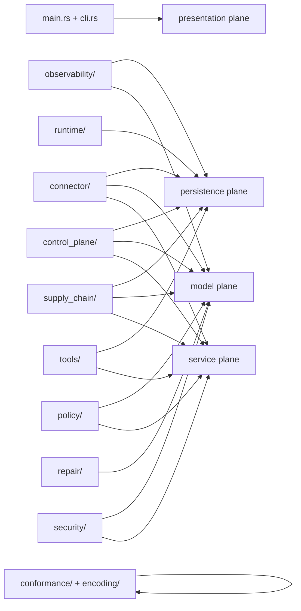

# Adjacent Substrate Dependency Map (`bd-28ld`)

This document defines where adjacent substrates are required inside `crates/franken-node/src`.

Integration type meanings:
- `mandatory`: required for this module family to satisfy plan constraints.
- `should_use`: preferred default; deviations require explicit review.
- `optional`: allowed when the module exposes that plane but does not always require it.

The machine-readable, file-level map is at:
- `artifacts/10.16/substrate_dependency_matrix.json`

That matrix explicitly covers every `*.rs` file and every subdirectory under `crates/franken-node/src`.

## Directory And Top-Level Module Map

| Module Path | Plane Coverage | Substrates | Integration Type | Notes |
|---|---|---|---|---|
| `crates/franken-node/src` | presentation, persistence, model, service | frankentui, frankensqlite, sqlmodel_rust, fastapi_rust | should_use | Product boundary spanning operator UX and control surfaces. |
| `crates/franken-node/src/conformance` | none | none | n/a | Internal harness/validators; no direct adjacent substrate binding. |
| `crates/franken-node/src/connector` | persistence, model, service | frankensqlite, sqlmodel_rust, fastapi_rust | mandatory/should_use | Core control connector surface with state, contracts, and service-facing behavior. |
| `crates/franken-node/src/control_plane` | persistence, model, service | frankensqlite, sqlmodel_rust, fastapi_rust | mandatory/should_use | Epoch/marker/root publication contracts and control API semantics. |
| `crates/franken-node/src/encoding` | none | none | n/a | Deterministic encoding primitives; internal only. |
| `crates/franken-node/src/observability` | persistence, model | frankensqlite, sqlmodel_rust | mandatory/should_use | Evidence ledger durability and typed evidence records. |
| `crates/franken-node/src/policy` | model, service | sqlmodel_rust, fastapi_rust | should_use | Policy logic and explainability surfaces for control-plane consumers. |
| `crates/franken-node/src/repair` | model | sqlmodel_rust | should_use | Typed repair proof/state contracts. |
| `crates/franken-node/src/runtime` | persistence | frankensqlite | should_use | Runtime durability and recovery-relevant state handling. |
| `crates/franken-node/src/security` | model, service | sqlmodel_rust, fastapi_rust | should_use/optional | Security policy and control API enforcement interfaces. |
| `crates/franken-node/src/supply_chain` | persistence, model, service | frankensqlite, sqlmodel_rust, fastapi_rust | should_use | Registry/provenance/revocation state and service integration points. |
| `crates/franken-node/src/tools` | persistence, service | frankensqlite, fastapi_rust | should_use/optional | Replay/export validators and operator tool endpoints. |
| `crates/franken-node/src/cli.rs` | presentation | frankentui | mandatory | CLI/TUI UX surface. |
| `crates/franken-node/src/config.rs` | model | sqlmodel_rust | should_use | Typed config model boundary. |
| `crates/franken-node/src/main.rs` | presentation, service | frankentui, fastapi_rust | should_use | Entry-point orchestration for operator and service pathways. |

## Plane Diagram

## Enforcement

Validation is automated by:
- `scripts/check_substrate_dependency_map.py`
- `tests/test_check_substrate_dependency_map.py`

The checker fails if:
- any `*.rs` file or subdirectory under `crates/franken-node/src` is missing from the matrix
- any plane coverage drops to zero
- `unmapped_modules` in the matrix diverges from computed results
